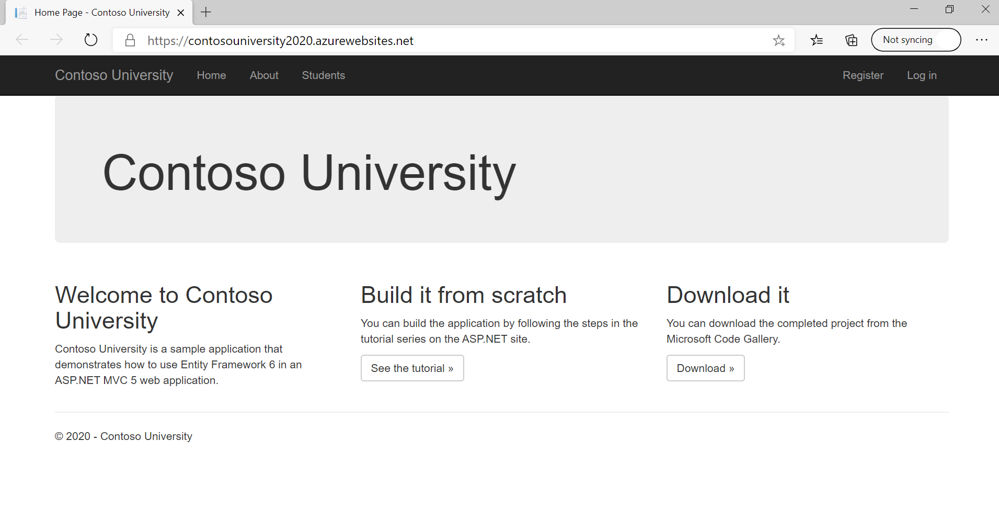

# **How to Deploy an ASP.NET Web App to Azure with SQL Database Using Visual Studio**

## **Overview**

In this scenario you will use a Visual Studio to deploy your web app
with a database to Azure App Service.

## **Pre-Requisites**

-   An active Azure Subscription.

-   Install Microsoft Visual Studio 2019 with the ASP.NET and web
    development workload.

## **Run the application on a local machine**

The ASP.NET app is displayed in a default browser.

The app uses a database context to connect with the database. So, the
database context uses a connection string named ***SchoolContext***. The
connection string is set in the ***Web.config*** file.

## **Publish to Azure with SQL Database**

In the **Solution Explorer**, right-click your **ContosoUniversity**
project and select **Publish**.

Make sure that **Microsoft Azure App Service** is selected and click
**Create Profile**.

## **Sign-in to Azure**

In the **Create App Service** dialog, click **Add an account**, and then
sign into your Azure subscription. If you're already signed into a
Microsoft account, make sure that account holds your Azure subscription.
In this case, I've already signed into my Microsoft account.

## **Configure the web app name**

You can keep the generated web app name or change it to another unique
name. The web app name is used as part of the default URL for your app
(`<app_name>.azurewebsites.net`, where `<app_name>` is your web app name).

## **Create a resource group**

A resource group is a logical container into which Azure resources like
web apps, databases, and storage accounts are deployed and managed.

Next to **Resource Group**, click **New**. Name the resource group
**ContosoAppRG** and click **OK**.

## **Create a Hosting Plan**

A Hosting Plan specifies the location, size and features of the web
server farm that hosts your web app.

Hosting plans define:

-   Region (for example: West US, East US, or North Europe)

-   Instance size (small, medium, or large)

-   Scale count (1 to 20 instances)

-   SKU (Free, Shared, Basic, Standard, or Premium)

Next to **Hosting Plan**, click **New**.

-   **Hosting Plan:** ContosoUniversity2020Plan (Hosting plans)

-   **Location:** West US (Azure regions)

-   **Size:** S1 (Pricing tiers)

    

## **Create a SQL Server instance**

Before creating a database, you need an Azure SQL Database logical
server. A logical server contains a group of databases managed as a
group.

Click **Create a SQL Database**.

In the **Azure SQL Database** dialog, Click **New** next to **Database
server**.

A unique server name is generated. This name is used as part of the
default URL for your logical server,
\<server_name\>.database.windows.net. You can change the server name,
but for this tutorial, keep the generated value.

Add an administrator username and password. For password complexity
requirements, please see [Password
Policy](https://docs.microsoft.com/en-us/sql/relational-databases/security/password-policy?view=sql-server-ver15).

Remember this username and password. You need them to manage the logical
server instance later.

Click **OK**. Don't close the **Azure SQL Database** dialog yet.

## **Create an Azure SQL Database**

In the **Azure SQL Database** dialog:

-   Keep the default generated **Database name**.

-   In **Connection string name**, type ***SchoolContext***. This name
    must match the connection string that is referenced in the
    ***Web.config*** file.

-   Select **OK**.

The **Create App Service** dialog shows the resources you've configure.
Click **Create**.

Click **Publish** to deploy your ASP.NET app to Azure App Service.

Once the wizard finishes creating the Azure resources, it publishes your
web app to Azure. So, your default browser is launched with the URL to
the deployed app.

Click the **Create New** button which is under the **Students** page to
add a student name and enrollment date.

Congratulations! Your data driven ASP.NET app is
running live in Azure App Service.

## **Next Steps:**

-   [[https://docs.microsoft.com/en-us/azure/app-service/overview-security]](https://docs.microsoft.com/en-us/azure/app-service/overview-security)

-   [[Buy and configure an SSL certificate for Azure App
    Service]](https://docs.microsoft.com/en-us/azure/app-service/web-sites-purchase-ssl-web-site)

-   [[Buy a custom domain name for Azure App
    Service]](https://docs.microsoft.com/en-us/azure/app-service/manage-custom-dns-buy-domain)

