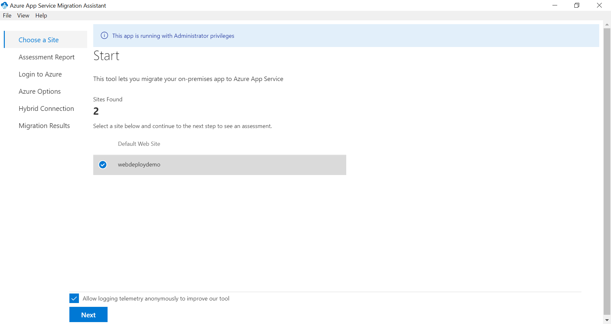

# **How to Migrate an ASP.NET Web App Using the App Service Migration Assistant Tool**

## **Overview**

In this scenario you will use the **App Service Migration Assistant**
tool to migrate your web app to Azure App Service.

## **Pre-Requisites**

-   An active Azure Subscription.

-   Deploy a web app to Internet Information Services (IIS) on your local machine.

    

## **Migrate Using the App Service Migration Assistant Tool**

1.  Navigate to the below URL to begin download the Migration Assistant
    tool

    a.  <https://appmigration.microsoft.com/>

2.  Click the **Download** button on the right.

3.  Click the **Download** link and accept terms to begin downloading
    the tool.

4.  Note: Once the download completes, run the **MSI installer** (Note:
    Installation will only succeed for the system administrator account)

5.  Once the installation completes the tool can be launched from the
    desktop shortcut "AppServiceMigrationAssistant".

6.  The tool should automatically detect the website and display below.

    

7.  Select the site you wish to migrate and click **Next**.

8.  This will return the results of the pre-migration readiness checks.

9.  Errors need to be resolved prior to migration. Warnings indicate that while the migration can proceed, but there may be additional configuration steps required outside of the App Service Migration Assistant Tool. For more information see [Azure App Service Migration Readiness Checks.](https://github.com/Azure/App-Service-Migration-Assistant/wiki/Readiness-Checks)

    

10. Click **Next** to proceed.

11. You will now be at the **Login to Azure** page.

    

12. Click **Copy Code & Open Browser** next to the device code. Then click **Next**. This will launch the default browser window. Once this is completed, you should see a page like the one below.

    

13. Press the **Ctrl-V** key to paste the code into the field. Once the code is entered, click **Next** to continue. Note: This code expires after 10 minutes. If the code is not accepted proceed back to the assessment phase, then click next to generate a new code.

14. You will be prompted to login with your Azure account. Once you have logged in, you should see a success message.

    

15. You may now close the browser and proceed back to the migration assistant tool.

16. You will now need to enter a device code for your tenant. The steps are identical to the previous step. Once the second login sign in is complete, proceed back to the tool. The tool will have advanced to the Azure Options page.

17. Fill in the options below.

    a.  Subscription.

    b.  Resource Group.

    c.  Destination Site Name.

    d.  Region.

    

    

18. The last task on this page is to configure the database. You will need to choose between setting up a **hybrid connection** to your on-premises database or skipping the database setup for now. We are choosing to setup the hybrid connection to our on-premises database.

19. The tool will detect any connection settings from the web.config for the database. Click **Migrate** to proceed.

20. You will now be on the **Setup Hybrid Connection Manager** page.

21. You will now be in the Migration Progress screen. Note this may take some time depending on the size of your site and other factors.

    

22. Once the migration completes you will need to setup the hybrid connection. On the **Setup Hybrid Connection Manager** page, click the link to download the MSI for installation.

    

23. Once the download completes, run the MSI installer. Click the box to accept the license terms then click install. Note: The installer will now complete without any further configuration actions needed.

24. Once the Hybrid Connection Manager installation completes, the App Service Migration Assistant tool should report "Successfully configured Hybrid Connection Manager".

    

25. Click **Next** to view the Migration Results page.

    

26. The migration process is completed. Click **Go to your website**.
    The migrated site should display.

    

