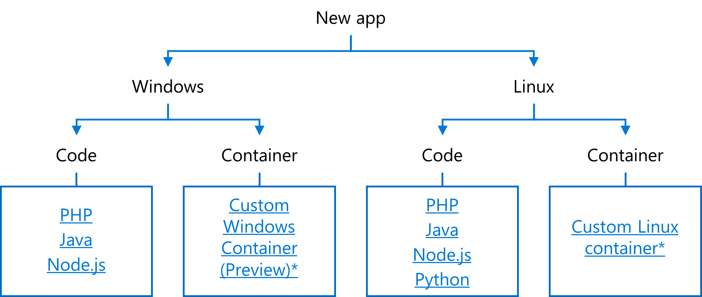
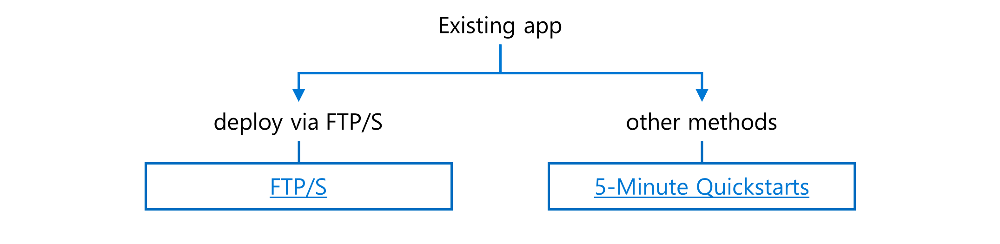

# **Post-deployment guide for Azure App Service customers**

This is a post-deployment guide for Azure App Service customers who have:

1.  a working URL in the format
    [https://\<example\>.azurewebsites.net]

2.  a custom domain name, and

3.  SSL certificates

## **Purpose of this document**

This document provides an overview of the resources available to help ease the on-boarding process to Azure App Service. It consists of three sections.

- Section 1: Prerequisites for using the guide 
    Links to help you deploy your app and connect it to a database

- Section 2: Steps for app configuration and optimization 
    Best practices for promoting your proof of concept app to production use

- Section 3: Considerations for special conditions and features
    Tips on how to optimize for specific environments and add advanced
    features/capabilities

## **Section 1: Prerequisites for using the guide**

### **1.1 How to deploy a web app**

If you have not yet deployed to Azure App Service, use the links below to build a new app or migrate an existing app.

*\*Note: You can create a custom container by using your code then specifying this image when creating the web app for containers.*

### **1.2 How to connect a database**

For apps that need to be connected to a database, you can use:

-   Microsoft Azure via [Azure MYSQL](https://docs.microsoft.com/en-us/azure/app-service/app-service-web-tutorial-php-mysql#connect-app-to-azure-mysql)

-   A database on-premises via [hybrid connections](https://docs.microsoft.com/en-us/azure/app-service/app-service-hybrid-connections#add-and-create-hybrid-connections-in-your-app)

-   SQL connection strings found in the Azure portal or through [App settings](https://blogs.msdn.microsoft.com/cjaliaga/2016/08/10/working-with-azure-app-services-application-settings-and-connection-strings-in-asp-net-core/)

## **Section 2: Steps for app configuration and optimization**

### **2.1 Enable always on**

Enable **Always On** to prevent the service from being unloaded when
idle. If the app is unloaded this can cause the response time to
increase.

1.  Enable this under general settings for your app.

### **2.2 Map a custom domain**

Map your app to a custom domain instead of the AzureWebsites.Net domain.

1.  Verify the app service plan level. If the plan is in the Dev/Test tier it needs to be upgrade to a production plan.

2.  Create a CNAME on your domain hosting provider. Map this to the `<app_name>.azurewebsites.net` for your web app.

3.  Enable CNAME mapping under the custom domains blade for your web app.

[Tutorial: Map an existing custom DNS name to Azure App Service](https://docs.microsoft.com/en-us/azure/app-service/app-service-web-tutorial-custom-domain#map-your-domain)

### **2.3 Secure the web app using SSL**

Bind an SSL certificate to your web app.

1.  Add a binding under custom domains in the Azure portal.

2.  Upload a the PFX certificate file for your certificate.

[Tutorial: Upload and bind SSL certificates to Azure App
Service](https://docs.microsoft.com/en-us/azure/app-service/app-service-web-tutorial-custom-ssl)

### **2.4 Setup an alert using Azure Monitoring**

Configure an alert for when CPU utilization exceeds 80% to allow you
time to act before issues arise. Other alerts can also be created
depending on your business needs.

1.  Configure an alert for the service plan under monitoring.

2.  Add a condition and specify CPU percentage.

3.  Create an email action that emails your account.

[Monitor apps in Azure App
Service](https://docs.microsoft.com/en-us/azure/app-service/web-sites-monitor)

### **2.5 Backup app instance state (i.e. configuration, site files, database)**

Create a backup of the current app instance state which contains the app
configuration, site files, and database. If you use alternate methods
for backing up these items, this step can be skipped.

1.  Configure a backup for your web app in the Azure portal.

2.  Specify a storage container.

3.  Specify the desired items for backup.

4.  Click backup to create a one-time backup or create a backup schedule
    if desired.

[Back up your app in
Azure](https://docs.microsoft.com/en-us/azure/app-service/manage-backup)

### **2.6 Configure a deployment slot**

Stage and test your app before you move to production using a deployment
slot. When an app is created, it is deployed into a single slot. To make
code changes, add a slot to deploy and test it before swapping the slot
into the production URL.

1.  In your App Service add slot to create a deployment slot. (Note:
    additional slots can be created as desired.)

2.  The deployment slot is now accessible via a separate URL.

3.  Once content is placed into the slot, you can use the swap button to
    move the slot to the primary URL.

[Set up staging environments in Azure App
Service](https://docs.microsoft.com/en-us/azure/app-service/deploy-staging-slots)

### **2.7 Update code using git or pushing complete container to Azure Container registry**

Enable continuous deployment via GitHub and other services. If you are
creating custom containers, you have the additional option of using the
Azure Container Registry service to push complete containers from your
development environment.

#### **Option 1: Code Deployment**

1.  Prepare your repository. App Service looks for files depending on
    your runtimes.

    -   To learn about the files needed, see [Prepare your
        repository](https://docs.microsoft.com/en-us/azure/app-service/deploy-continuous-deployment#prepare-your-repository)

2.  Authorize GitHub under the deployment center for your web app.

3.  Select a build server.

4.  Select the repository and branch to deploy.

5.  Authorize the Azure App Service in GitHub.

[Continuous deployment to Azure App
Service](https://docs.microsoft.com/en-us/azure/app-service/deploy-continuous-deployment)

#### **Option 2: Deployment using containers**

1.  Enable continuous deployment with Azure Container Registry.

2.  Enable continuous deployment with Docker Hub by enabling in the
    container settings of your web app.

3.  Add the webhook from your web app to Docker Hub.

[Continuous deployment with Web App for
Containers](https://docs.microsoft.com/en-us/azure/app-service/containers/app-service-linux-ci-cd)

### **2.8 Configure Autoscaling**

Create additional instances of the web app to meet increase in demand.

1.  Enable autoscaling for the app.

2.  Scale base on metric.

3.  Create a metric rule with the default settings. (Note: This creates
    an autoscale rule when average CPU exceeds 70)

4.  Save the scale out rule.

[Create an Autoscale Setting for Azure resources based on performance
data or a
schedule](https://docs.microsoft.com/en-us/azure/azure-monitor/learn/tutorial-autoscale-performance-schedule)

### **2.9 Scale up your app**

Access the needs of your app and scale up or scale out for better
performance or load time. For dev/test scenarios the Standard plan (S1
instance) should suffice. For productions scenarios the Premier plan,
beginning with P1v2, is equipped for better performance.

[Scale up an App in
Azure](https://docs.microsoft.com/en-us/azure/app-service/web-sites-scale)

## **Section 3: Considerations for special conditions and features**

### **3.1 Authenticate through an identity provider**

Activate the built-in module in Azure App Service that will
automatically perform authentication on behalf of your app. Supported
identity providers include Azure AD, Facebook, and Google.

[Authenticate and authorize in Azure App
Service](https://docs.microsoft.com/en-us/azure/app-service/overview-authentication-authorization)

### **3.2 Deploy a common workload such as WordPress or Drupal**

Find pre-configured templates for common apps from Azure Marketplace to
quickly deploy an empty app for a new deployment or migration.

[Find your solution in the Azure Marketplace](https://azuremarketplace.microsoft.com/en-us/marketplace/)

[Discover more information on WordPress and Drupal by visiting the GIT repository](https://github.com/Azure/App-Service-Migration-Assistant/wiki)

### **3.3 Access resources on an Azure virtual network without the traversing the internet**

Connect your app to a resource, such as a database running in an Azure
virtual machine, using an existing Vnet integration.

[Integrate your app with an Azure Virtual Network](https://docs.microsoft.com/en-us/azure/app-service/web-sites-integrate-with-vnet)

### **3.4 Limit the network addresses that connect to your app**

Build an allow/deny list to restrict which addresses your web app will
respond to using Azure App Service Access Restrictions.

[Create access restrictions in App Service](https://docs.microsoft.com/en-us/azure/app-service/app-service-ip-restrictions)

### **3.5 Integrate with on-premises enterprise applications**

Integrate with over 200 enterprise apps and platforms, such as
SharePoint, Office 365, Outlook, and SAP, using available connectors.

[Use connectors for Azure Logic Apps](https://docs.microsoft.com/en-us/azure/connectors/apis-list)

### **3.6 Enable an App Service Environment (ASE)**

[App Service Environment](https://docs.microsoft.com/en-us/azure/app-service/environment/intro#overview) (ASE) provides a very high scale, isolated environment, that offers more granular security and networking controls. Consider using the ASE
feature if one of the following situations applies to your use case:

1.  A regulatory requirement prohibits multi-tenant environments. For
    example, PCI or HIPPA.

    -   In this case, ASE places your app onto dedicated hardware that
        is configured to be compliant with most regulatory situations.

    -   [Tour the Isolated App Service
        offering](https://channel9.msdn.com/Shows/Azure-Friday/Security-and-Horsepower-with-App-Service-The-New-Isolated-Offering?term=app%20service%20environment)

2.  You require granular network access control/logging or to keep an
    app isolated (I.e. not accessible via the internet).

    -   By using an ASE, you can isolate your app into an Azure virtual
        network and use that configuration to:

        -   Block all internet traffic to your web app.

        -   Direct all traffic through a web application firewall.

        -   Log all traffic using 3^rd^ party network capture tools.

    -   [Learn how to implement a layered security
        architecture](https://docs.microsoft.com/en-us/azure/app-service/environment/app-service-app-service-environment-layered-security)

3.  You want to build an easily scalable app that is likely to exceed
    the service limits of App Service.

    -   The ASE allows you to create an additional ASE environment from a template. For example, you have the maximum 100 instances, but you expect a spike in usage to exceed capacity. This could be accomplished by using a template to create identical
        environments and then removing later.

    -   [Create an ASE by using an Azure Resource Manager         template](https://docs.microsoft.com/en-us/azure/app-service/environment/create-from-template)

### **3.7 Set-up a WAF post-deployment**

Secure your business-critical applications to withstand malicious
requests and inspect inbound web traffic.

[Configure a Web Application Firewall (WAF) for App Service Environment](https://docs.microsoft.com/en-us/azure/app-service/environment/app-service-app-service-environment-web-application-firewall)

### **3.8 Networking features in App Service Environment**

Avoid unneeded features like VNet Integration or service endpoints, just
access the resources you want with no additional configuration

[Learn more about networking features in an ASE](https://docs.microsoft.com/en-us/azure/app-service/networking-features#app-service-environment)

### **3.9 Configure Custom Warm-Up actions**

Avoid downtime for your app by specifying required Warm-Up actions before traffic is redirected to a different instance of the app ( Note: The latter scenario only applies if you have added instances to your web app ). This can occur if the deployment slot is swapped, or if underlying host OS maintenance tasks are required. In either case the custom actions will assure the app is able to deliver requests prior to redirecting the traffic.

[Specify custom warm-up](https://docs.microsoft.com/en-us/azure/app-service/deploy-staging-slots#specify-custom-warm-up)

### **3.10 High availability considerations**

For high availability consider setting the minimum instances for your
web app to 3. The app service will automatically attempt to distribute
these across the 3 availability zones for your region.

-   [Create your first Autoscale setting](https://docs.microsoft.com/en-us/azure/azure-monitor/platform/autoscale-get-started#create-your-first-autoscale-setting)

-   [Demystifying the magic behind app service os updates](https://azure.github.io/AppService/2018/01/18/Demystifying-the-magic-behind-App-Service-OS-updates.html)

For additional availability consider configuring a multi-region web app using [paired regions](https://docs.microsoft.com/en-us/azure/best-practices-availability-paired-regions#what-are-paired-regions).
When deploying infrastructure updates, the rollout process attempts to keep at least one of the paired regions unmodified in the event of an issue.

-   [Run a web application in multiple Azure regions for high     availability](https://docs.microsoft.com/en-us/azure/architecture/reference-architectures/app-service-web-app/multi-region)
