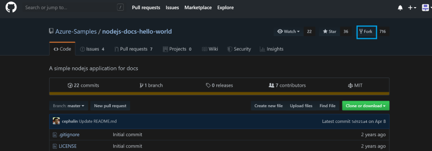
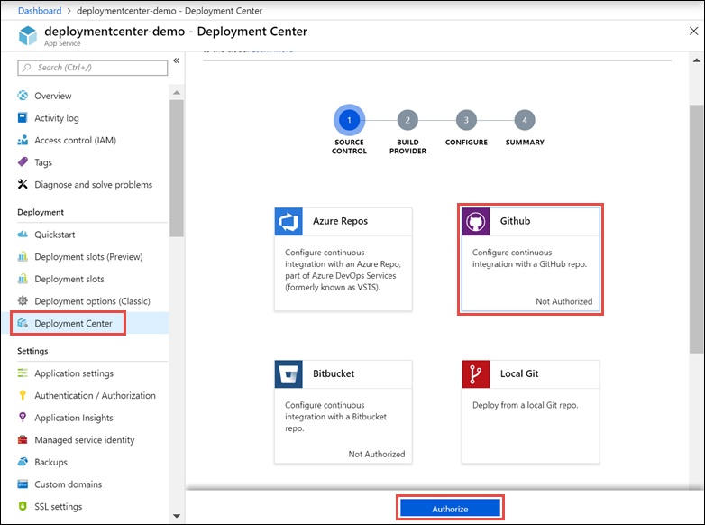
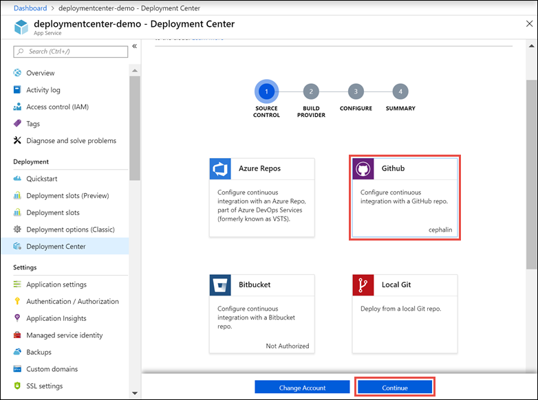
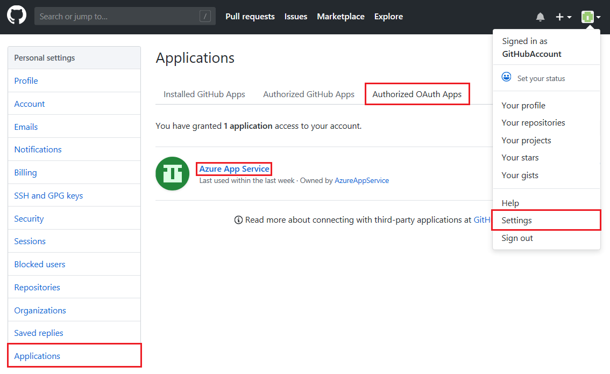
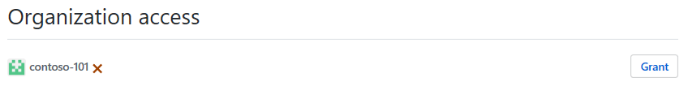
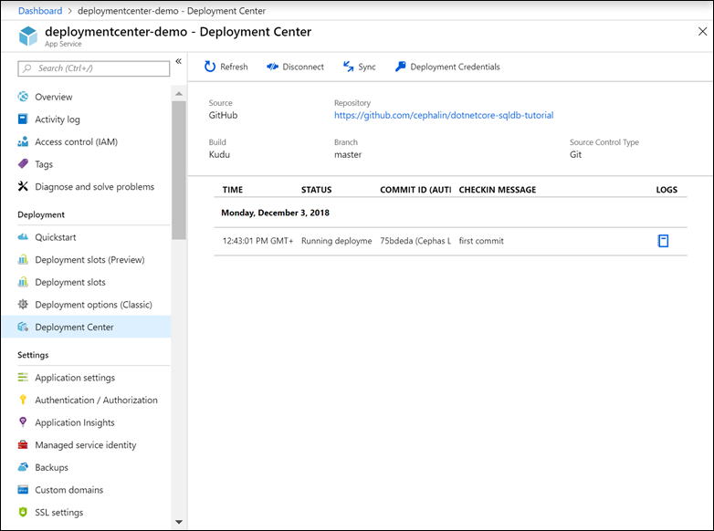
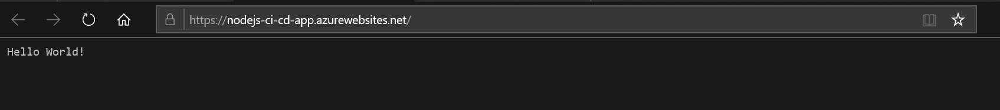
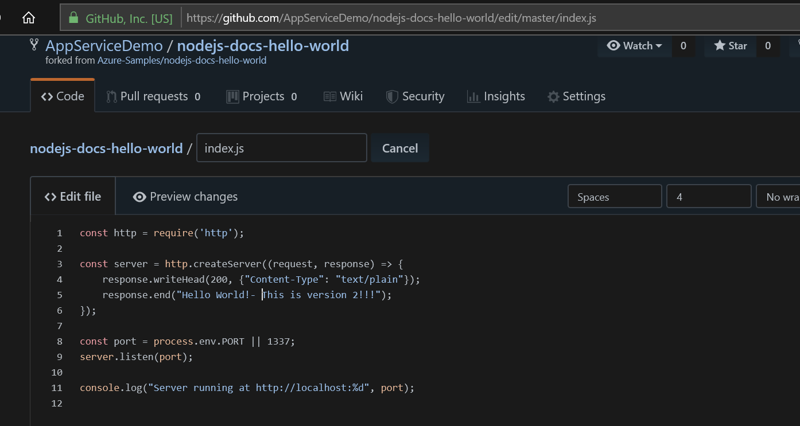
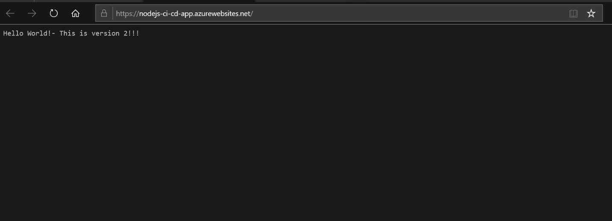

# **Continuous Deployment to Azure App Service**

## **Overview**

This article shows you how to configure continuous deployment for [Azure App Service](https://docs.microsoft.com/en-us/azure/app-service/overview).
App Service enables continuous deployment from Bitbucket, GitHub, and [Azure DevOps Services](https://www.visualstudio.com/team-services/) by pulling in the most recent updates from your existing repository in one of these services.

To find out how to configure continuous deployment manually from a cloud repository not listed by the Azure portal (such as [GitLab](https://gitlab.com/)), see [Setting up continuous deployment using manual steps](https://github.com/projectkudu/kudu/wiki/Continuous-deployment#setting-up-continuous-deployment-using-manual-steps).

## **Prepare your repository**

To get automatic builds from the Azure App Service Kudu build server, make sure that your repository root has the correct files in your project.

  |**Runtime**|**Root directory files**|
  |-----------|------------------------|
  |Node.js    |*server.js*, *app.js*, or *package.json* with a start script|


To customize your deployment, include a *.deployment* file in the repository root. For more information, see [Customize deployments](https://github.com/projectkudu/kudu/wiki/Customizing-deployments) and [Custom deployment script](https://github.com/projectkudu/kudu/wiki/Custom-Deployment-Script).

**Note:**

If you develop in Visual Studio, let [Visual Studio create a repository for you](https://docs.microsoft.com/en-us/azure/devops/repos/git/creatingrepo?view=vsts&tabs=visual-studio).
The project is immediately ready to be deployed by using Git.

Publish your prepared repository to one of the supported services. For more information on publishing your project to these services, see [Create a repo (GitHub)](https://help.github.com/articles/create-a-repo), [Create a repo (BitBucket)](https://confluence.atlassian.com/get-started-with-bitbucket/create-a-repository-861178559.html), and [Get started with Azure DevOps Services](https://docs.microsoft.com/azure/devops/user-guide/devops-alm-overview).

## **Create a resource group**

A [resource group](https://docs.microsoft.com/en-us/azure/azure-resource-manager/resource-group-overview#terminology) is a logical container into which Azure resources like web apps, databases, and storage accounts are deployed and managed. For example, you can choose to delete the entire resource group in one simple step later.

In the Cloud Shell, create a resource group with the [`az group create`](https://docs.microsoft.com/en-us/cli/azure/group?view=azure-cli-latest#az-group-create) command. The following example creates a resource group named *myResourceGroup* in the *South Central US* location. To see all supported locations for App Service in **Free** tier, run the [`az appservice list-locations --sku FREE`](https://docs.microsoft.com/en-us/cli/azure/appservice?view=azure-cli-latest#az-appservice-list-locations) command.

```azure-cli
az group create --name myResourceGroup --location "South Central US"
```

## **Create an Azure App Service plan**

In the Cloud Shell, create an App Service plan with the [az appservice plan create](https://docs.microsoft.com/en-us/cli/azure/appservice/plan?view=azure-cli-latest#az-appservice-plan-create) command.

The following example creates an App Service plan named myAppServicePlan in the **Free** pricing tier:

```azure-cli
az appservice plan create --name myAppServicePlan --resource-group
myResourceGroup --sku FREE
```

## **Create a web app**

In the Cloud Shell, create a web app in the myAppServicePlan App Service plan with the [`az webapp create`](https://docs.microsoft.com/en-us/cli/azure/webapp?view=azure-cli-latest#az-webapp-create) command.

In the following example, replace \<app_name\> with a globally unique app name (valid characters are a-z, 0-9, and -).

```azure-cli
az webapp create --resource-group myResourceGroup --plan myAppServicePlan --name <app_name>
```

## **Set Node.js runtime**

Set the Node runtime to 10.14.1 To see all supported runtimes, run [`az webapp list-runtimes`](https://docs.microsoft.com/en-us/cli/azure/webapp?view=azure-cli-latest#az-webapp-list-runtimes).

```azure-cli
az webapp config appsettings set --resource-group myResourceGroup --name *<app_name>* --settings WEBSITE_NODE_DEFAULT_VERSION=10.14.1
```

## **Fork a sample NodeJS app from GitHub**

To test continuous deployment from a GitHub we will begin by forking a sample app.

Navigate to the following link <https://github.com/Azure-Samples/nodejs-docs-hello-world>. Then click the **Fork** button.


## **Deploy continuously from GitHub**

To enable continuous deployment with GitHub, navigate to your App Service app page in the [Azure portal](https://portal.azure.com/).

In the left menu, click **Deployment Center** \> **GitHub** \> **Authorize**. Follow the authorization prompts.



You only need to authorize with GitHub once. If you\'re already authorized, just click **Continue**. You can change the authorized GitHub account by clicking **Change account**.



In the **Build provider** page, choose the build provider and click \> **Continue**.

### **Option 1: use App Service Kudu build Server**

In the **Configure** page, select the organization, repository, and branch from which you want to deploy continuously. When finished, click **Continue**.

To deploy from a repository in a GitHub organization, browse to GitHub and go to **Settings** \> **Applications** \> **Authorized OAuth Apps**. Then click \"Azure App Service\".



In the next page, grant App Service access to your organization\'s repositories by clicking the \"Grant\" button on the right-hand side.



Your organization should now show in the \"Organization\" list in the **Configure** page of the Deployment Center.

## **Finish configuration**

In the **Summary** page, verify your options and click **Finish**.

When configuration completes, new commits in the selected repository are deployed continuously into your App Service app.



## **Test the deployment**

Once the deployment completes, test the site by navigating to web app URL.



## **Make a code change and re-test deployment**

Return to GitHub and make a change to the code. Edit the index file to make a minor change. Then commit the change.

The commit will be synced. Check the URL for your web app.



## **Additional information:**

-   [Continuous deployment to Azure App
    Service](https://docs.microsoft.com/en-us/azure/app-service/deploy-continuous-deployment)

-   [How to investigate common issues with continuous
    deployment](https://github.com/projectkudu/kudu/wiki/Investigating-continuous-deployment)
