# **Deploying and Containerizing an existing on-premises app using docker and Azure Container Registry**

## **Migration using Docker Containers**

In addition to our other tools we can migrate to the Azure App Service
by leveraging Docker and the Azure Container service. This allows for a
stepped migration from an app hosted on an on-premises webserver, to an
on-premises docker instance, then deploying to the Azure App Service.
Depending on your needs this may be a better option for your
development, and testing. We will be demonstrating the process with a
basic PHP connecting to a MySQL backend. First we will deploy the app
locally, then migrate the database to Azure, connect the app to the
database, migrate the app to a container, then deploy the container on
the Azure App Service

## **Prerequisites** 

To complete this tutorial:

-   [Install Git](https://git-scm.com/)

-   [Install PHP 5.6.4 or above](https://php.net/downloads.php)

-   [Install Composer](https://getcomposer.org/doc/00-intro.md)

-   Enable the following PHP extensions Laravel needs: OpenSSL,
    PDO-MySQL, Mbstring, Tokenizer, XML

-   [Install and start MySQL](https://dev.mysql.com/doc/refman/5.7/en/installing.html)

-   A workstation with Docker installed and Visual Studio Code with Docker Extension.

-   [An Azure container registry.](https://docs.microsoft.com/en-us/azure/container-registry/container-registry-get-started-portal)

## **Prepare local MySQL**

In this step, you create a database in your local MySQL server for your use in this tutorial.

### **Connect to local MySQL server**

1.  In a terminal window, connect to your local MySQL server. You can use this terminal window to run all the commands in this tutorial.

    `mysql -u root -p`

    If you\'re prompted for a password, enter the password for the root account. If you don\'t remember your root account password, see [MySQL: How to Reset the Root Password](https://dev.mysql.com/doc/refman/5.7/en/resetting-permissions.html).

    If your command runs successfully, then your MySQL server is running. If not, make sure that your local MySQL server is started by following the [MySQL post-installation
    steps](https://dev.mysql.com/doc/refman/5.7/en/postinstallation.html).

### **Create a database locally**

2.  At the mysql prompt, create a database.

    ```sql
    CREATE DATABASE sampledb;
    ```

    Exit your server connection by typing quit.

## **Create a PHP app locally**

In this step, you get a Laravel sample application, configure its
database connection, and run it locally.

### **Clone the sample**

In the terminal window, cd to a working directory.

3.  Run the following command to clone the sample repository.

    ```shell
    git clone <https://github.com/Azure-Samples/laravel-tasks>
    ```

4.  cd to your cloned directory. Install the required packages.

    ```cmd
    cd laravel-taskscomposer install
    ```

### **Configure MySQL connection**

5.  In the repository root, create a file named *.env*. Copy the
    following variables into the *.env* file. Replace the
    *\<root_password\>* placeholder with the MySQL root user\'s
    password.

    ```ini
    APP_ENV=local
    APP_DEBUG=true
    APP_KEY=SomeRandomString
    DB_CONNECTION=mysql
    DB_HOST=127.0.0.1
    DB_DATABASE=sampledb
    DB_USERNAME=root
    DB_PASSWORD=<root_password>
    ```

    For information on how Laravel uses the *.env* file, see [Laravel Environment Configuration](https://laravel.com/docs/5.4/configuration#environment-configuration).

### **Run the sample locally**

6.  Run [Laravel database migrations](https://laravel.com/docs/5.4/migrations) [to create the tables the application needs. To see which tables are created in the migrations, look in the] *database/migrations* directory in the Git repository.

    `php artisan migrate`

7.  Generate a new Laravel application key.

    `php artisan key:generate`

8.  Run the application.

    `php artisan serve`

    Navigate to <http://localhost:8000> in a browser. Add a few tasks in the page.

    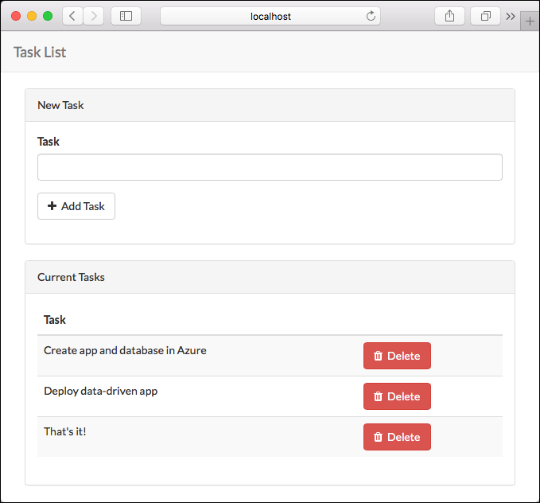

To stop PHP, type Ctrl + C in the terminal

## **Create an Azure Database for MySQL server**

Our next task is to create a MySQL database in Azure. You create an Azure Database for MySQL server with a defined set of [compute and storage resources](https://docs.microsoft.com/en-us/azure/mysql/concepts-compute-unit-and-storage).
You create the server within an [Azure resource group](https://docs.microsoft.com/en-us/azure/azure-resource-manager/resource-group-overview).

Follow these steps to create an Azure Database for MySQL server:

1.  Select **Create a resource** (+) in the upper-left corner of the portal.

2.  Select **Databases** \> **Azure Database for MySQL**. You can also enter **MySQL** in the search box to find the service.

    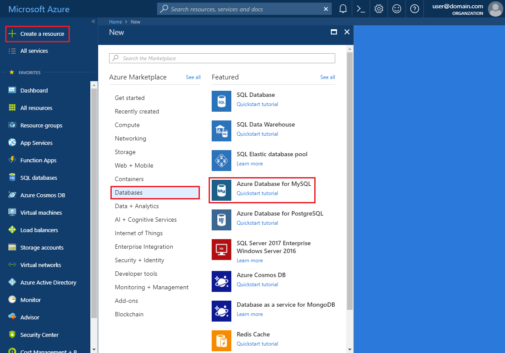

3.  Fill out the new server details form with the following information:

    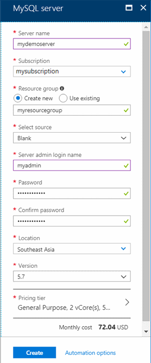

    |**Setting**            | **Suggested value**    | **Field description**|
    |-----------------------|-----------------------|-----------------------|
    |Server name            | Unique server name     | Enter a unique name that identifies your Azure Database for MySQL server.|
    |Subscription           | Your subscription      | Select the Azure subscription that you want to use for your server.|
    |Resource group         | *myresourcegroup*      | Provide a new or existing resource group name.|
    |Select source          | *Blank*                | Select *Blank* to create a new server from scratch.|
    |Server admin login     | myadmin                | A sign-in account to use when you\'re connecting to the server. The admin sign-in name cannot be **azure_superuser**, **admin**, **administrator**, **root**, **guest**, or **public**.|
    |Password               | *Your choice*          | Provide a new password for the server admin account. It must contain from 8 to 128 characters.|
    |Confirm password       | *Your choice*          | Confirm the admin account password.|
    |Location               | *The region closest to your users* | Choose the location that is closest to your users or your other Azure applications.|
    |Version                | *The latest major version* | The latest major version (unless you have specific requirements that require another version).|
    |Pricing tier           | **General Purpose**, **Gen 5**, **2 vCores**, **5 GB**, **7 days**, **Geographically Redundant**            | The compute, storage, and backup configurations for your new server. Select **Pricing tier**. Next, select the **General Purpose** tab. *Gen 5*, *4 vCores*, *100 GB*, and *7 days* are the default values for **Compute Generation**, **vCore**, **Storage**, and **Backup Retention Period**. You can leave those sliders as is.|

    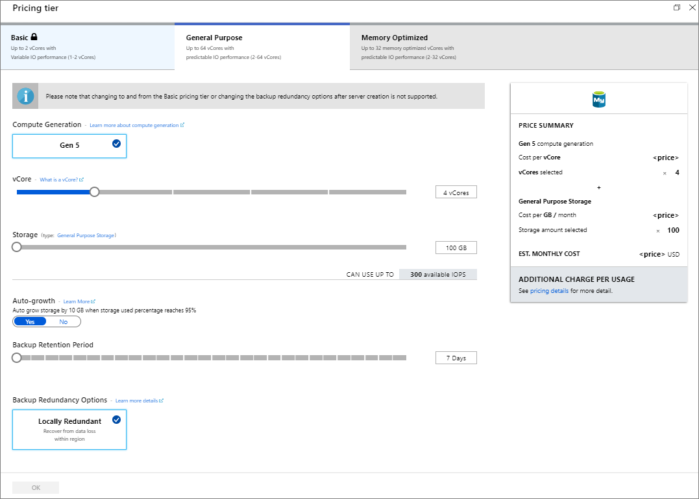

4.  Select **Create** to provision the server. Provisioning can take up to 20 minutes.

5.  Select **Notifications** on the toolbar (the bell icon) to monitor the deployment process.

6.  By default, the following databases are created under your server:
    **information_schema**, **mysql**, **performance_schema**, and **sys**.

## **Migrate the Database**

### **Create a backup file from the command-line using mysqldump**

1.  To back up an existing MySQL database on the local on-premises
    server or in a virtual machine, run the following command:

    ```azure-cli
    $ mysqldump --opt -u [uname] -p [pass] [dbname] >
    [backupfile.sql]
    ```

    The parameters to provide are:

    -   `[uname]` Your database username

    -   `[pass]` The password for your database (note there is no space between -p and the password)

    -   `[dbname]` The name of your database

    -   `[backupfile.sql]` The filename for your database backup

    -   `[--opt]` The mysqldump option

    For example, to back up a database named \'sampleDB\' on your MySQL server with the username \'testuser\' and with no password to a file sampleDB \_backup.sql, use the following command. The command backs up the testdb database into a file called sampleDB \_backup.sql, which contains all the SQL statements needed to re-create the database.

    ```shell
    $ mysqldump -u root -p sampleDB > sampleDB_backup.sql
    ```

### **Create a database on the target Azure Database for MySQL server**

Create an empty database on the target Azure Database for MySQL server
where you want to migrate the data. Use a tool such as MySQL Workbench.
The database can have the same name as the database that is contained
the dumped data or you can create a database with a different name.

1.  To get connected, locate the connection information in the
    **Overview** of your Azure Database for MySQL.

    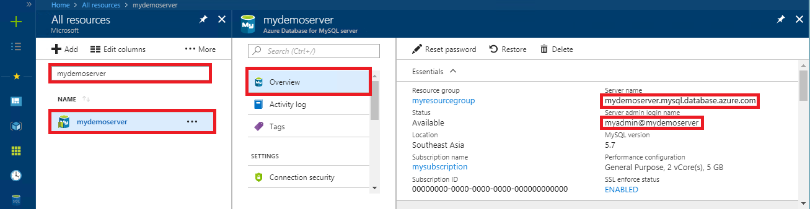

2.  Add the connection information into your MySQL Workbench.

    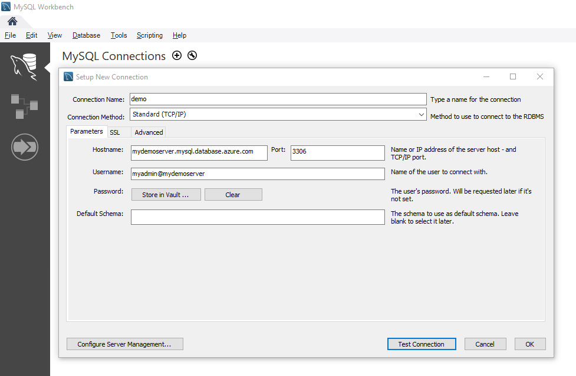

### **Restore your MySQL database using command-line or MySQL Workbench**

Once you have created the target database, you can use the mysql command
or MySQL Workbench to restore the data into the specific newly created
database from the dump file.

```shell
mysql -h [hostname] -u [uname] -p [pass] [db_to_restore] <
[backupfile.sql]
```

In this example, restore the data into the newly created database on the target Azure Database for MySQL server.

```shell
mysql -h mydemoserver.mysql.database.azure.com -u myadmin@mydemoserver -p testdb < sampleDB _backup.sql
```

## **Change ENV file to connect to Azure**

Now that you have created the Azure Database you can connect your web
app by modifying the ENV file with the connection details you used in
the previous steps.

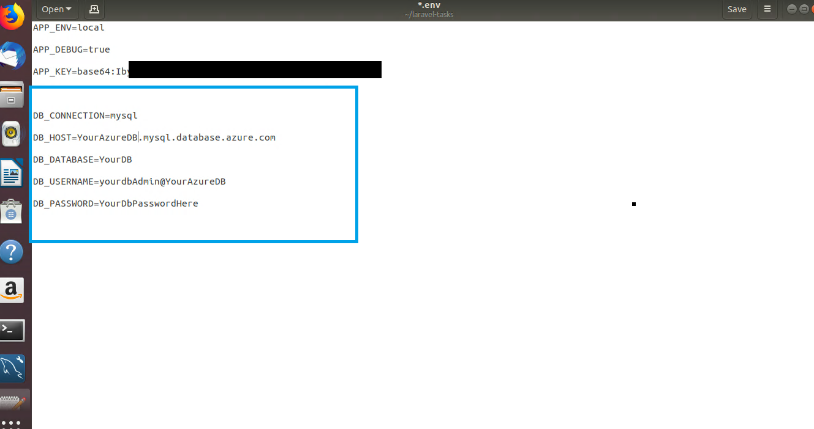

-  Edit the entries to the left and replace them with the connection information from the overview section for your Azure Database server.

## **Create a Docker Container and copy the Site files.**

1.  Move the Laravel-tasks folder to the machine with docker installed.

    a.  In our case the Linux machine was configured in Hyper-V. We used the RDP connection to copy and paste a Zipped folder containing Laravel-tasks. Other methods such as FTP may be used as well

2.  Create folder for your project copy the contents of laravel-tasks folder into it.

3.  Create a file named dockerfile (no extensions)

4.  Open the file using notepad and add the following lines.

    <pre>
    FROM php:7.2-apache
    COPY . /var/www/html/
    run chmod -R 777 /var/www/html
    run docker-php-ext-install pdo pdo_mysql
    </pre>

5.  You should end up with something similar to the screenshot below.

    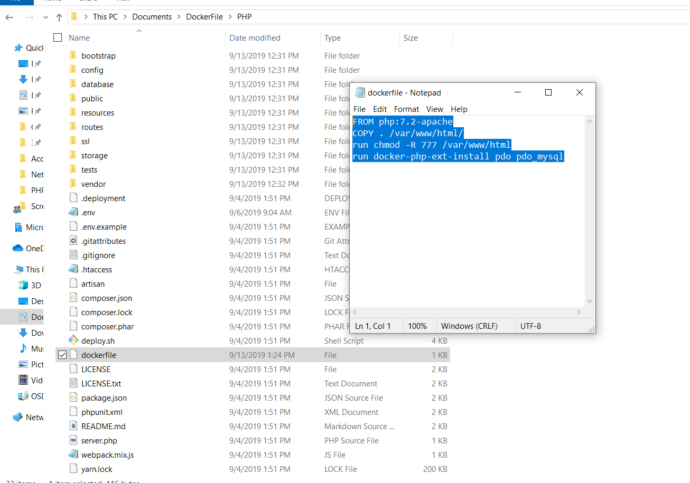

6.  Open a command window or PowerShell in this folder and enter the following command to build a container with app files from the PHP official image, then enable the PHP database extension.

    `docker build -t php/task:1.0 .`

7.  Move to visual studio code and find the docker image the click **Run Interactive.**

    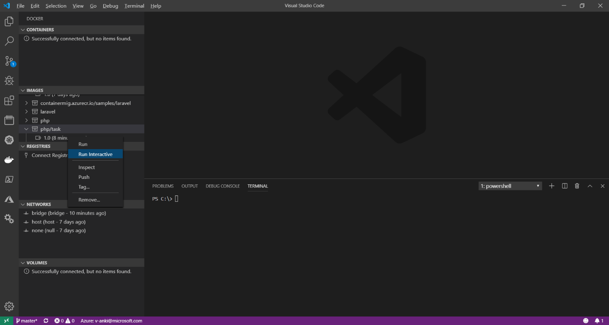

8.  If you receive an error related to network use the up arrow to
    retrieve the command. After --**p** change port on the left to port
    other than 80. For example, **-p 888:80**

9.  Right click the running container and select **Attach Shell.**

10. In the shell session enter the following command:

    ```shell
    a2enmod rewrite && apt-get update && apt-get install vim && vim /etc/apache2/sites-enabled/000-default.conf
    ```

11. The previous command installs vim and opens the default site
    configuration. Add **/public** to the document root and save.

12. Type **exit** to escape the container shell session.

13. To save the changes to your container find the friendly name (found next to container instance) and type:

    `Docker commit friendly_name php/task`

    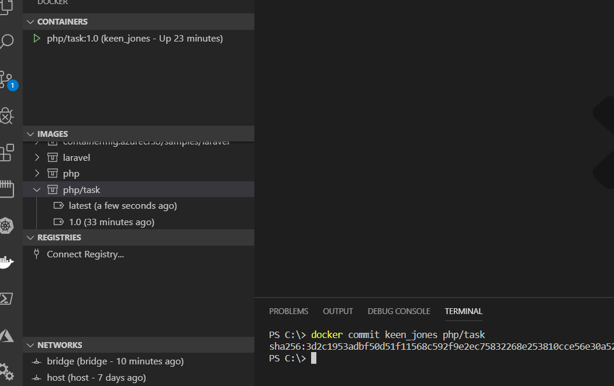

14. Now that the container has been updated restart the container. The site should now be exposed on port 888.

15. Navigate to the site by typing **localhost:888**

    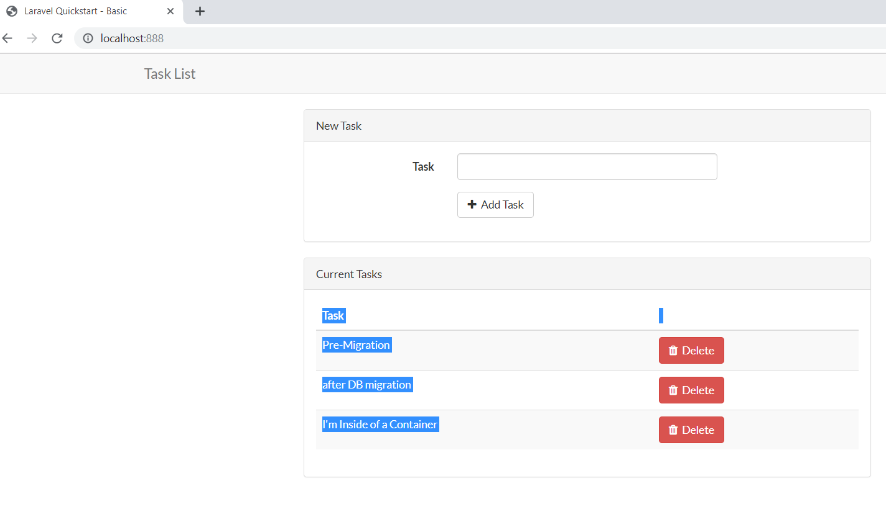

## **Upload your container to #Azure Container Registry**

In this step we will push the container image from your local
workstation to the Azure container registry.

### **Login to the registry**

1.  Retrieve the login info from the Azure Portal by navigating to the
    container registry and clicking the **Access keys** blade. This
    contains the information needed in the next step. (Note you may need
    to **Enable** the admin user.)

    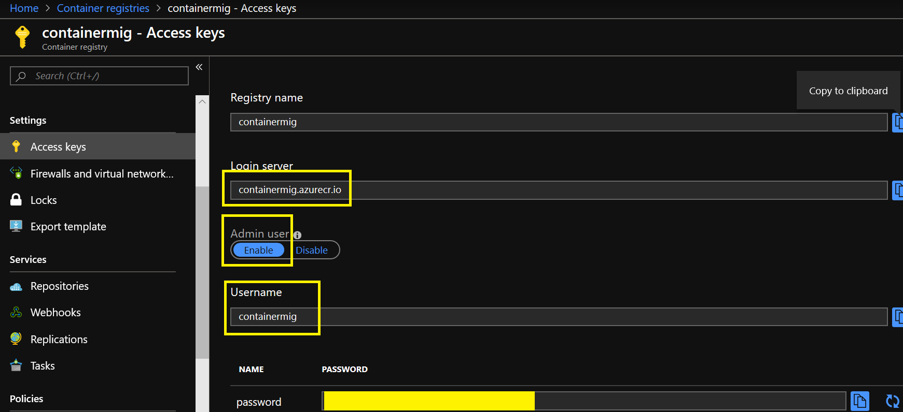

2.  On your Docker Workstation enter the following command to login.
    (Replacing myregistry with the information from your access key page)

    `docker login myregistry.azurecr.io`

3.  You will be prompted for the credentials.

    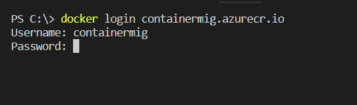

4.  Tag an alias of the Docker image with the ACR information by
    entering the following command. (Replacing the php/task and
    myregistry with your settings.)

    `docker tag php/task myregistry.azurecr.io/samples/task`

    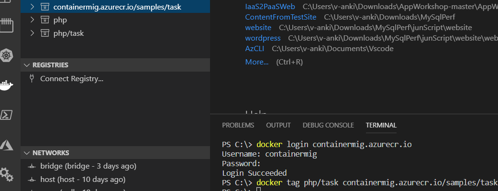

5.  Next, we will push the tagged image to ACR. With the following command

    `docker push myregistry.azurecr.io/samples/task`

6.  Navigate to your container registry and the container will now show up.

    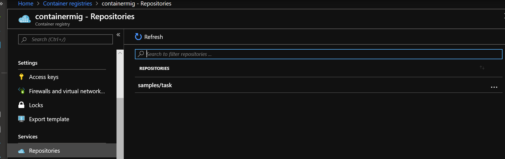

### **Create a Web App using your container**

1.  In the Azure Portal click the **+** to create a new resource and select **Web App for Containers.**

    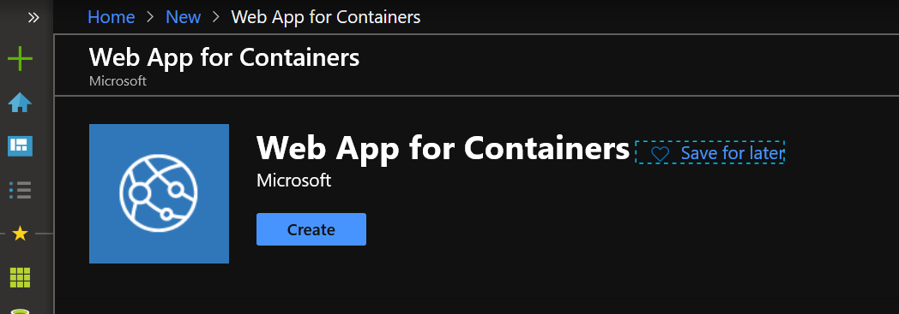

2.  Choose the basic settings configure the app, plan, resource group settings. then click **Next: Docker \>**

    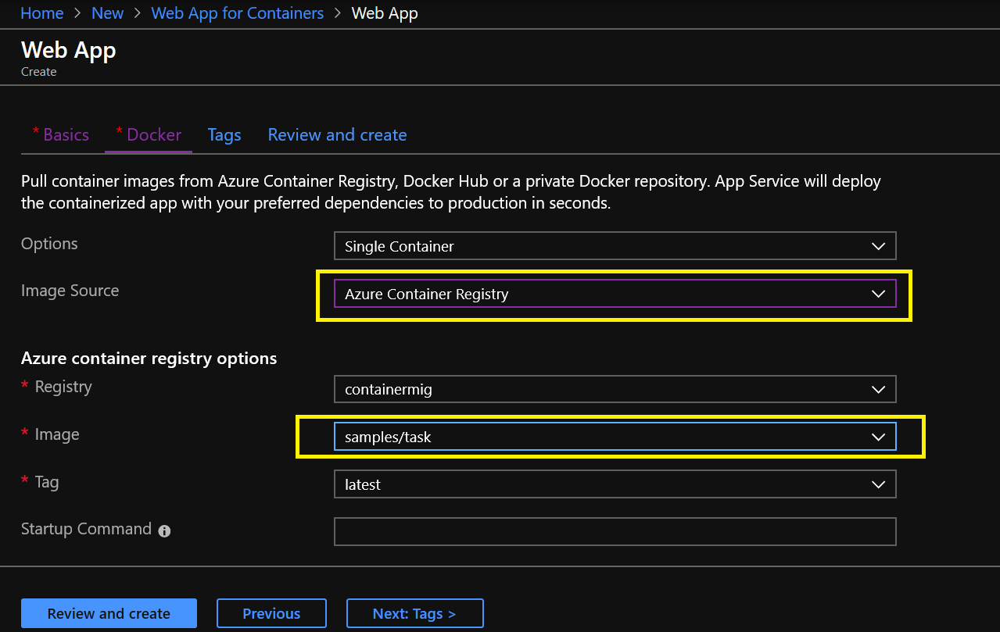

3.  Specify the **Image Source** as **Azure Container Registry.** (Note if only 1 image is in the registry it should automatically default to that image.)

4.  Click **Review and create.** Then create the web app.

5.  The app is now available at the Web App URL.

    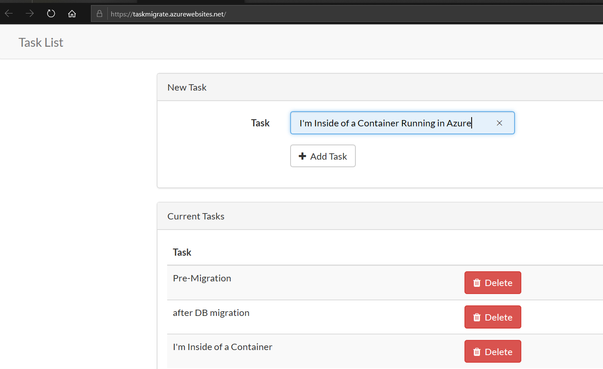

6.  For added measure we can create new task.

    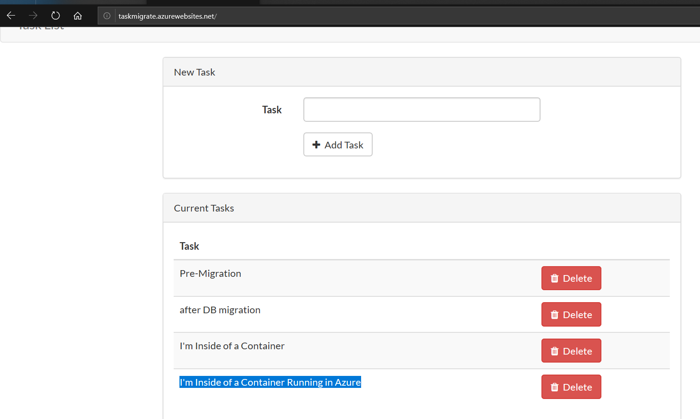

## **Additional information:**

-   [QuickStart: Build and run a container image using Azure Container Registry Tasks](https://docs.microsoft.com/en-us/azure/container-registry/container-registry-quickstart-task-cli)

-   [Tutorial: Create a container image for deployment to Azure Container Instances](https://docs.microsoft.com/en-us/azure/container-instances/container-instances-tutorial-prepare-app)

-   [About registries, repositories, and images](https://docs.microsoft.com/en-us/azure/container-registry/container-registry-concepts)
