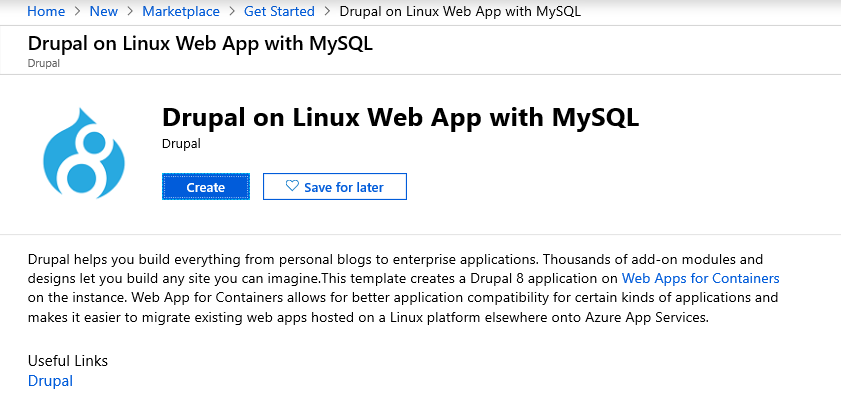

# **Best Practices for Drupal CMS on Azure Websites**

[Drupal CMS](http://drupal.org/) is an open-source Content Management
System written in PHP and use MySQL. Drupal offers a refined programming
interface for developers; no programming skills are required for a basic
website and installation. You can use Drupal to build everything from
personal blogs to enterprise applications. It is a popular framework
among government organizations as well. The primary focus of this blog
post is to articulate how to run Drupal CMS websites on Azure Websites
platform and in this process, you will learn:

-   How to migrate existing Drupal site to Azure Websites

-   How to setup Azure Storage Module for Media content

-   How to improve with caching

-   Use best practices for Drupal CMS

-   Scale across regions

## **How to migrate an existing Drupal site to Azure Web Apps**

Migrating your Drupal website to Azure Web App is a fairly easy task.
Just follow the steps below and you can move your entire Drupal site in
an hour.

-   Note: If your site uses a local Apache Solr search provider. Prior to uploading site data/files, you will need to change the Drupal container image to [**appsvcorg/solr**](https://hub.docker.com/r/appsvcorg/solr)

-   To change this, navigate to your app service then find **Container
    settings** and change the **Image** (See Below).

    

## **Create an Azure Web Site and MySQL database**

The simplest method to provision Drupal with MySQL is to use the Drupal
on Linux Web App with MySQL. This creates a web app for containers
instance that is preconfigured with the base Drupal application stack
and database connections. You can begin creating a Web App by searching
the marketplace or following this link: [Drupal on Linux Web App with
MySQL.](https://ms.portal.azure.com/#create/Drupal.Drupalonlinux) Once
your web app is created you can proceed with the next steps.



## **Copy database to MySQL in Azure Web Apps**

For most situations, a MySQL Dump and Restore can be used to migrate
your MySQL database. This can be done through Command Line Interface
(CLI) or MySQL Workbench. For step-by-step migration instructions see:
[Migrate your MySQL database to Azure Database for MySQL using dump and
restore.](https://docs.microsoft.com/en-us/azure/mysql/concepts-migrate-dump-restore)

You first need to have to provide the username and password for your
existing Drupal database. You also have to provide the hostname,
username, password, and database name for the MySQL database you created
in the first step. This information is available under the **Connection
Strings** blade for the Azure MySQL database you just created. The
connection string information should have a format similar to the
following.


Depending on the size of your database, the copying process could take
several minutes. Now your Drupal database is live in Azure Websites.
Before you deploy your Drupal code, you need to modify it so it can
connect to the new database.

## **Modify database connection info in settings.php**

Here, you again need your new database connection information. Open the
**\<drupalsite\>/sites/default/setting.php** file in a text editor, and
replace the values of \'database\', \'username\', \'password\', and
\'host\' in the **\$databases** array with the correct values for your
new database. When you are finished, you should have something similar
to this:

```shell
$databases = array ('default'=>array ('default'=>array('database'=>'remote_db_name','username'=>'remote_username','password'=>'remote_password','host'=>'remote_host','port'=>'','driver'=>'mysql','prefix'=>'',),),);
```

**Note:** If you have a **\$base_url** configuration parameter in your
**settings.php**, comment it out since Drupal CMS will create the URLs
from the value set for **\$base_url**. You can use the **\$base_url**
parameter once you have your azure website configured to use the custom
domain such as [www.exmaple.com](http://www.exmaple.com/) . Save the
**settings.php** file. Now you are ready to deploy.

## **Deploy Drupal code using Git or FTP**

The last step is to deploy your code to Azure Web Sites using Git or
FTP.

If you intend to use Git to publish your Drupal site, you may review the
steps in the link below that explains how to configure a Git repository.
See [Create a PHP-MySQL Azure web site and deploy using
Git.](https://azure.microsoft.com/en-us/develop/php/tutorials/website-w-mysql-and-git/)

-   If you are using FTP, get the FTP hostname and username from your
    website\'s dashboard. Then, use any FTP client to upload the Drupal
    files to the **/site/wwwroot** folder of the remote site.

-   If you are using Git, you should have set up a Git repository in the
    previous steps. You must install Git on your local machine. Then,
    follow the instructions provided after you created the repository.
    Review this
    [article](https://azure.microsoft.com/en-us/documentation/articles/web-sites-php-mysql-deploy-use-git/)
    for configuring Git

## **How to improve performance with caching**

Websites that receive massive large amounts of user traffic (hundreds of thousands to millions of page views and unique visitors) will benefit from the use of a caching with Redis cache. For more information on available caching solutions see [Best practices for cloud applications:
Caching](https://docs.microsoft.com/en-us/azure/architecture/best-practices/caching).
The general approached for caching is having a mix of Content Delivery Network (CDN) and backend cache (Redis) service. Drupal uses the database to store cache. If any content is modified, then Drupal detects this change and expires the cache hence maintaining content consistency.
Redis replaces Drupal\'s internal caching system. You can also use
[Varnish as Front end cache](https://azure.microsoft.com/en-us/blog/using-varnish-as-front-end-cache-for-azure-web-apps/) instead of a CDN to significantly improve performance.

## **Use Best Practices for Drupal CMS**

A common practice for any website on the cloud is to

1.  **Plan for the future:** You must track the performance and
    requirements of your website and user traffic patterns to be able to
    project when you need to scale up or scale down your infrastructure
    or modify your infrastructure to meet your latest requirements.

2.  **Backup your site:** Backup both your website and the database.
    Test your backup and restore procedures.

Now let\'s focus on Drupal CMS and learn some of the best practices for
building and managing Drupal CMS on Azure websites:

## **Security configuration:**

3.  Remove sensitive temporary files while you edit files, this may
    create temporary backup files such as file ending with .bak, ending
    with a \~ character, **settings.php.orig**. These files are viewable
    in a browser if you haven\'t restricted it in the **web.config**
    using URL rewrite rules. This can lead to attackers gaining access
    to critical information. Remove any such files present on the
    website. This can be solved by adding the URL rewrite rules in
    **web.config** to deny access to any of these files or you can
    automate this by using a simple web job that looks for these files
    and deletes them automatically.

4.  Enable **SSL** for login Drupal does not require the use of Secure
    Sockets Layer (SSL), when users log in. Hence it makes it easier for
    attackers to gain administrative access to your website. Install and
    enable the [Secure Pages](http://drupal.org/project/securepages)
    module from drupal.org. This module can ensure that any/user URLs
    are served using SSL.

5.  Disallow unsafe file uploads and image fields allow users to upload
    files. A malicious user can use this to gain control of your website
    by uploading a file that can cause havoc on your system. Restrict
    what file types are support for files, image uploads, and remove any
    extensions like .exe, .swf,.flv,.htm,.php,.vb,.vbs.

6.  Enable **Security Kit** module: The Security Kit module provides
    useful security enhancements to your website such as Clickjacking,
    Cross-Site Request Forgery (CSRF), and Cross-Site Scripting (XSS)
    protections among others. This module\'s default configuration is
    recommended but If your website has some special requirements that
    this module may block, review the configuration and update as
    desired. To learn more, see [Security Kit
    module](https://drupal.org/project/seckit).

7.  Do not use common admin usernames, your admin username (User ID 1)
    should not be **admin, administrator, and root** which are commonly
    used and can represent a security vulnerability to your website. Use
    complex or unique usernames to avoid exploits.

8.  Hide Site errors from end-user, these error messages can reveal
    sensitive information about your website and its server to site
    visitors. To configure your website to not display error messages
    for users, on your website, open the Logging and errors page at
    /admin/config/development/logging, select **None** from the
    **Error** messages to display section, and then click **Save**
    configuration.

9.  Enable the **Password Policy** module content editors for your
    websites may use simple passwords for their login credentials and
    which in turn can open doors to attackers to exploit. To reduce the
    vulnerability here, enable [the Password policy
    module](https://drupal.org/project/password_policy) to enforce
    strict password policies.

## **Performance configuration**

10. Page cache max-age less than 5 minutes with a page cache max-age set
    to less than 5 minutes, the server has to frequently regenerate
    pages. This can decrease your site\'s performance. To set the page
    cache max age to 5 minutes or more, on your website, open the
    Performance page at /admin/config/development/performance, and then
    select a new value from the **Page cache max-age** drop-down.

11. Optimize CSS and JS scripts with CSS/JS optimization disabled, your
    website visitors are experiencing slower page performance and the
    server load is increased. To enable CSS optimization, on your
    website, open the Performance page
    at/admin/config/development/performance, and then select Aggregate
    and compress CSS files. To enable JavaScript optimization, on your
    website, open the Performance page
    at/admin/config/development/performance, and then select Aggregate
    JavaScript files.

## **Azure website configuration**

12. Enable **Web server logging** and use a **Storage** account to store
    the logs. You can reuse the same storage that you have set up for
    media content. For more information, see [Azure website
    diagnostics](https://azure.microsoft.com/en-us/documentation/articles/web-sites-enable-diagnostic-log/).

13. Setup Auto-scale which will scale up or scale down your website
    based on the traffic and load on your website dynamically. For more
    information, see [Auto-scale
    Configuration](https://docs.microsoft.com/en-us/azure/architecture/best-practices/auto-scaling).

14. Choose the appropriate app service tier to support your workload.
    Basic or Standard mode will give you dedicated VM instances to run
    your website for better performance. For more detailed information,
    see [Features by
    tiers](https://azure.microsoft.com/en-us/pricing/details/web-sites/).

15. Configure the site to use at-least 2 Medium or Large instances
    (instance refers to a VM that is abstracted for your website). If
    you use a single instance, if the instance goes into a bad state
    then your site will be down. Using 2 instances will avoid this
    single point of failure.

16. Load test your website using tools like Visual Studio Load test
    tools or [Load test with the Azure
    portal](https://docs.microsoft.com/en-us/azure/devops/test/load-test/app-service-web-app-performance-test?view=azure-devops)
    to make sure your scale at which you configured your site actually
    handle your website traffic.

17. Setup Auto-healing for your website which recycles your VM instances
    based on a condition. For more information, see [How to Auto-heal
    your
    website](https://azure.microsoft.com/blog/2014/02/06/auto-healing-windows-azure-web-sites/).

## **Coding practices**

18. Avoid changes to Drupal core if possible Making changes to the
    Drupal Core will make it harder to manage version updates for Drupal
    on your website and will be difficult to maintain as your website
    grows.

19. Avoid using too many modules Drupal gives you\'re the flexibility to
    add modules to extend the feature set of the CMS, but too many
    modules can impact the performance of your site and make it slow.

20. Include a web.config to run on Azure websites uses IIS, and hence
    add a web.config with the configuration below to protect
    unauthorized access to files and manage clean URLs. Use the sample
    web.config for a Drupal website as shown
    [here](https://groups.drupal.org/node/25421). You should disable
    Application Request Routing cookie which pins a user\'s subsequent
    requests to a specific instance if enabled. Disabling it will allow
    your website to use the normal load balancing behavior of the
    platform. To learn more, See [Disable ARR
    Cookie](https://azure.microsoft.com/en-us/blog/disabling-arrs-instance-affinity-in-windows-azure-web-sites/).
    To do this in your web.config file add the following section under
    **\<system.webserver\>**

    ```html
    <httpProtocol>
        <customHeaders>
            <add name="Arr-Disable-Session-Affinity" value="True" />
        </customHeaders>
    </httpProtocol>
    ```


## **Scale Drupal across multiple regions**

By hosting a Drupal website across multiple regions, you mitigate the
risk associated with a single point of failure when you have a single
website running in one data center. A key thing to remember with Cloud
solutions is that you need to assume that every component (website,
database, cache, etc.) may fail and make your solution resilient. This
will reduce any operational costs incurred due to service outages that
form a part of your infrastructure. For this scenario, you need to host
your Drupal website in at least two regions, say we choose East US and
West US region. See the figure shows an Active-Active (Master-Master)
website configuration for a Drupal Website:

21. Two Azure Websites linked to their respective MySQL databases.

22. Both MySQL databases are synchronized with database replication.

23. Azure Traffic Manager to load balancing end-user traffic based on
    Performance.

24. Managed Redis service.

25. Azure Storage (Geo-redundant) with Azure CDN.

This architecture is fairly simple to create, but if your application
has special requirements, then are you can tweak the above configuration
to meet your needs. You can update this configuration:

-   Create a Master-Slave website configuration

-   Create one master and multiple-slaves website configuration

-   Use custom replication processes using Web Jobs

-   Automate management processes using Web Jobs

### **Scaling the Web Site**

Scaling up on Azure Web Sites involves two related actions: changing
your Web Hosting Plan mode to a higher level of service, and configuring
certain settings after you have switched to the higher level of service.
Both topics are covered in this article. Higher service tiers like
Standard mode offer greater robustness and flexibility in determining
how your resources on Azure are used. For more details, see [How to
scale Azure
website](https://azure.microsoft.com/en-us/documentation/articles/web-sites-scale/).

### **Scaling the database**

Your application depends on two components which are the Azure website
and the database. To be able to scale your database for high
availability and disaster recovery for your database there are many
options depending on how to create your database. For example, here are
two scenarios:

26. Azure Database for MySQL offers database replication across region
    pairs (example: East US and West US ) See: [Replicate data into
    Azure Database for
    MySQL](https://docs.microsoft.com/en-us/azure/mysql/concepts-data-in-replication)

27. You may also set up a [MySQL Cluster
    CGE](http://www.mysql.com/products/cluster/) which gives you all the
    tools to manage a MySQL Cluster on an Azure Virtual Machine. Note
    that in this case, you will be manually managing all the MySQL
    clusters, database replication, and scale operations.

### **Scaling your Redis cache**

Azure Redis cache scaling feature is currently in preview. Azure Redis
cache has different cache offering which provides flexibility in the
choice of cache size and features. You can scale the size of the cache
using the **Change pricing tier** blade in the [Azure
portal](https://portal.azure.com/). To learn more on how to scale your
cache, click
[here](https://azure.microsoft.com/en-us/documentation/articles/cache-how-to-scale/).

### **Setup Traffic Manager to route your user traffic**

Azure traffic manager allows you to control the distribution of user
traffic to your specified endpoints, which can include web sites.
Traffic Manager works by applying an intelligent policy engine to Domain
Name System (DNS) queries for the domain names of your Internet
resources. Your cloud services or web sites can be running in the same
data center or in different data centers across the world. For a
comparison of the available routing, methods see [Traffic Manager
routing
methods](https://docs.microsoft.com/en-us/azure/traffic-manager/traffic-manager-routing-methods).

-   **Performance**: Select *Performance* when you have endpoints in
    different geographic locations, and you want requesting clients to
    use the \"closest\" endpoint in terms of the lowest latency. For
    more information, see [Performance load balancing
    method](https://msdn.microsoft.com/en-us/library/azure/dn339010.aspx).

Create a new **Azure Traffic Manager profile** service endpoint from
Azure Management portal.


Once the resource is created, now access your dashboard for traffic manager profile and open **Endpoints** and click on **Add** to configure it to use the websites you want to route the traffic to.


In the **Add** dialog box, select Service type as **Azure endpoint,** Target resource type as **App Service** and choose the websites you want to route the user traffic to from Target resource.


Now you can see that our endpoint is added to the traffic manager.


You can browse the traffic manager URL from the **Overview** tab and you will see that the traffic is being routed as per your configuration.


## **Wrapping it up!**

We have covered the basic tasks and concerns involved with moving a Drupal website to Azure Websites. The solutions discussed above will make migration and configuration of your Drupal websites on Azure websites service easier irrespective of whether your Drupal site is small or large. Now let\'s start building and scaling your Drupal websites on Azure websites platform.
