# **How Do I Migrate an Existing Drupal Site to Azure Web App for Containers in Linux?**

## **Prerequisites**

-   An Azure Drupal on Linux App Service to serve as a destination.

-   A Source Linux Drupal installation needing migration. You will need
    administrative access to the site files and MySQL database.

-   MySQL Database Requirements:

    -   Azure Database for MySQL currently only supports versions
        5.6.3.5 and 5.7.1.8 using the InnoDB engine.

    -   If you have MyISAM tables, convert them to InnoDB before
        migration. For more information, see the MySQL article
        [Converting Tables from MyISAM to
        InnoDB](https://dev.mysql.com/doc/refman/5.6/en/converting-tables-to-innodb.html).

## **Overview**

-   The two key components of your Drupal site are the Site Files and
    MySQL database. In this scenario we will move the Site Files and
    Database from your existing installation to the Azure App Service.

-   We have a basic Drupal site configured on a Linux Virtual Machine.
    We have posts, theme, and media which need to be migrated.

    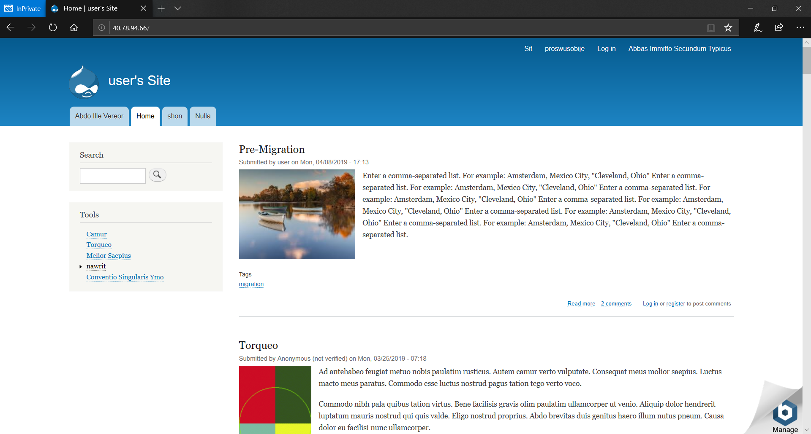

## **Create a destination Drupal site in Azure**

1.  Use the following link to begin creation of a Drupal on Linux Web
    App

    a.  <https://ms.portal.azure.com/#create/Drupal.Drupalonlinux>

2.  Enter an **App name, Resource Group, and App Service plan/Location**

3.  Click the **Database** blade and create a new MySQL database server then click **OK**.

    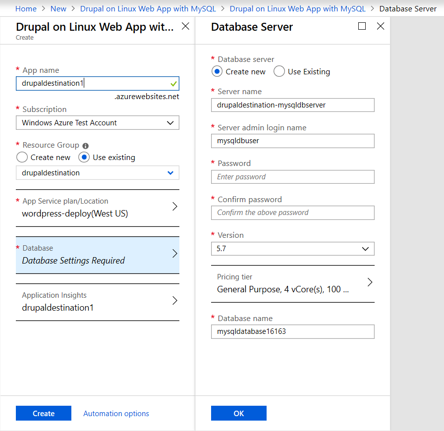

4.  Click **Create** to begin deploying the Drupal on a Linux Web app.


## **Migrate your site files**

Download your Site files from your source server.

1.  Connect to your existing server. We are using FTP with the FileZilla client. You may have different tools available depending on your hosting provider.

2.  Identify your Drupal site directory. In our case the location is
    "/opt/bitnami/apps/Drupal/htd".

    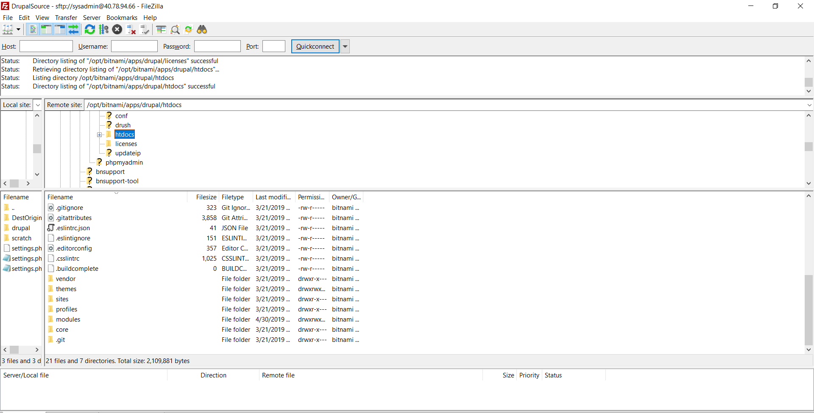

3.  Download the root directory. This may take some time.

    Upload your Site files to your destination App Service.

4.  Find the **FTPS Hostname** URL and **FTP/Deployment Username** in
    the App service overview. (If you have not created deployment
    credentials or need to reset the password click the **Deployment
    Credentials** blade on the left to do this.)

    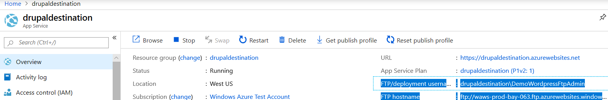

5.  Use an FTP client to connect to the Azure App service site with by
    entering:

    a.  The FTPS URL into the hostname field.

    b.  The Deployment Username into the username field.

    c.  The Deployment Username password into the password field.

    d.  Connect, there may be a certificate warning. Click **OK**.

    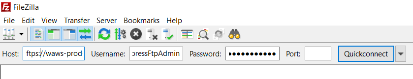

6.  The directory structure will look like the screenshot below.

7.  Navigate into **drupal_prj/** directory.

8.  Rename the **web** to **webOLD**. (The webOLD directory can be
    deleted later. However, this can take a 30-40 minutes over FTP. The
    end goal is an empty web folder.)

9.  Create a new **drupal_prj/web** directory. (Note the directory is case sensitive.)

    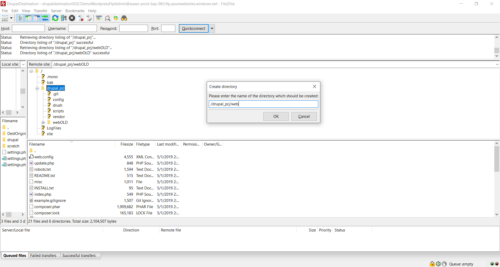

10. Open the directory you exported from your source site.

11. Select all your files and upload the contents into the **web** folder.

    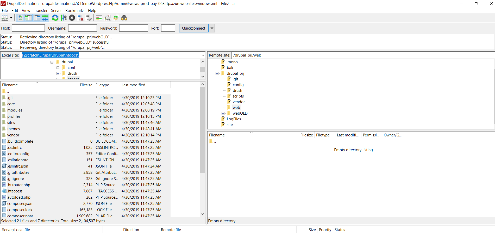

12. The file upload will begin. This may take some time.

## **Backup the MySQL Drupal Database and import the database into your Azure Drupal on Linux App Service**

For this step we will create a MySQL backup on your source server then remotely push the database to your new Azure Database for MySQL. The commands executed can all be run on the source machine.

1.  We will first need some information from your Azure MySQL server.
    This can be located in the Azure portal under the overview for the
    MySQL database.

    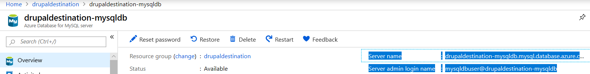

2.  We need the **Server name**, and **Server admin login name**.

3.  We also need the name for the blank database created on the initial creation of the database. Scroll down to the bottom of the page. Under **Available resources** the databases on the server will be listed.

    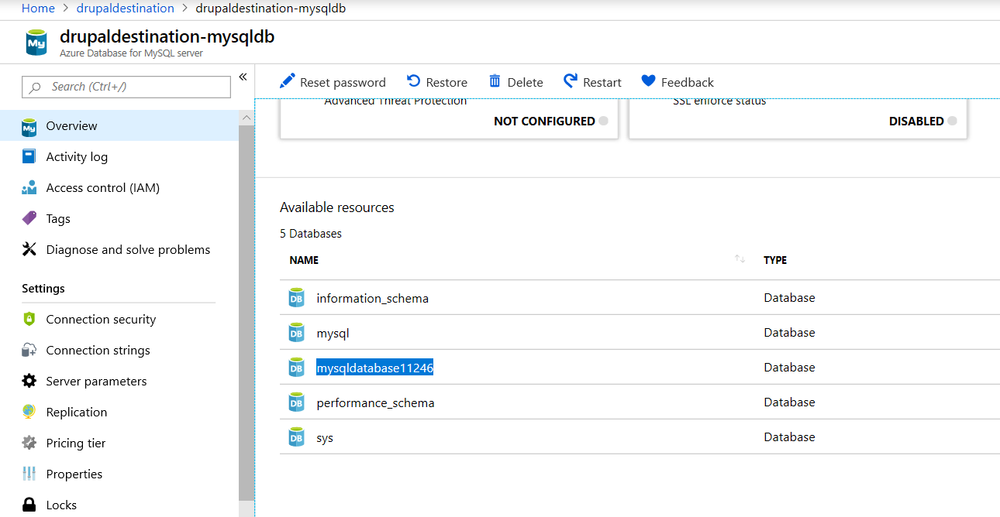

4.  Unless you specified another database name, the naming should be
    similar to the highlighted database. In our example this database
    name is **"mysqldatabase11246"**.

5.  SSH into your source machine

6.  To back up an existing MySQL database on the local on-premises
    server or in a virtual machine, run the following command:

    -   ```shell
        $ mysqldump --opt -u [uname] -p[pass] [dbname] >
        [backupfile.sql]
        ```

        -   The parameters to provide are:

        -   `[uname]` Your database username

        -   `[pass]` The password for your database (Note there is no
            space between -p and the password)

        -   `[dbname]` The name of your Drupal database

        -   `[backupfile.sql]` The filename for your database backup

        -   `[--opt]` The mysqldump option

    -   For example, to back up a database named `'testdb'` on your MySQL server with the username `'testuser'` and with no password to a file `testdb_backup.sql`, use the following command. The command backs up the testdb database into a file called `testdb_backup.sql`, which contains all the SQL statements needed
        to re-create the database.

        -   `$ mysqldump -u root -p testdb > testdb_backup.sql`

7.  Use mysql commands to restore the data into the specific newly
    created database from the dump file.

    ```shell
    mysql -h [hostname] -u [uname] -p[pass] [db_to_restore] < [backupfile.sql]
    ```

    -   **Note:** Hostname is your Azure Server name, uname is azure server admin name, `db_to_restore` is the name of the empty database on your Azure server, backupfile.sql is the backup file you created in the previous task.

8.  In this example, restore the data into the newly created database on the target Azure Database for MySQL server.

    ```shell
    $ mysql -h mydemoserver.mysql.database.azure.com -u myadmin@mydemoserver -p mysqldatabase11246 < testdb_backup.sql
    ```

## **Edit settings.php to set the new database.**

The last step is to edit the site files to connect to the new database.

1.  Connect to your site again using FTP.

2.  Find the **settings.php** in **/drupal_prj/web/sites/default**.

    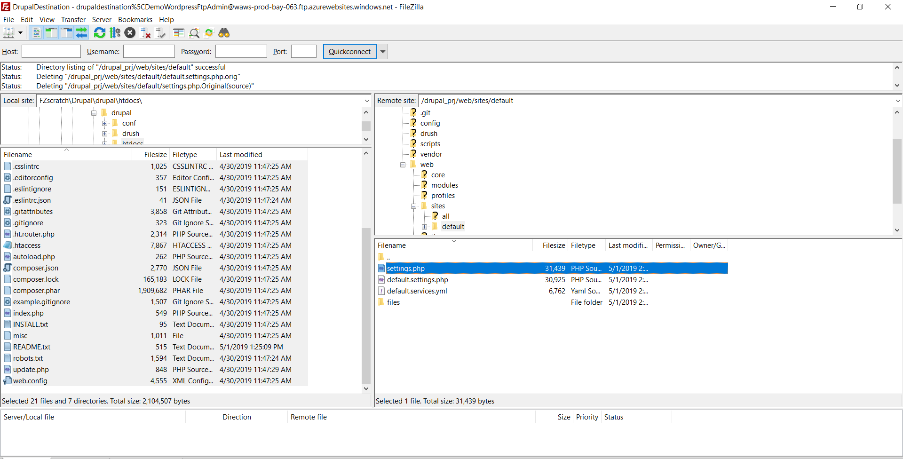

3.  Right click to edit the file. Find the uncommented database section.

4.  Update:

    a.  Database

    b.  Username

    c.  Password

    d.  Host

    e.  Remove any additional entries that are hard coded to specific
        directories.

        i.  Example our site had an entry for `'unix_socket' => '/opt/bitnami/mysql/tmp/mysql.sock',`

5.  The end result should look similar to the screenshot below.

    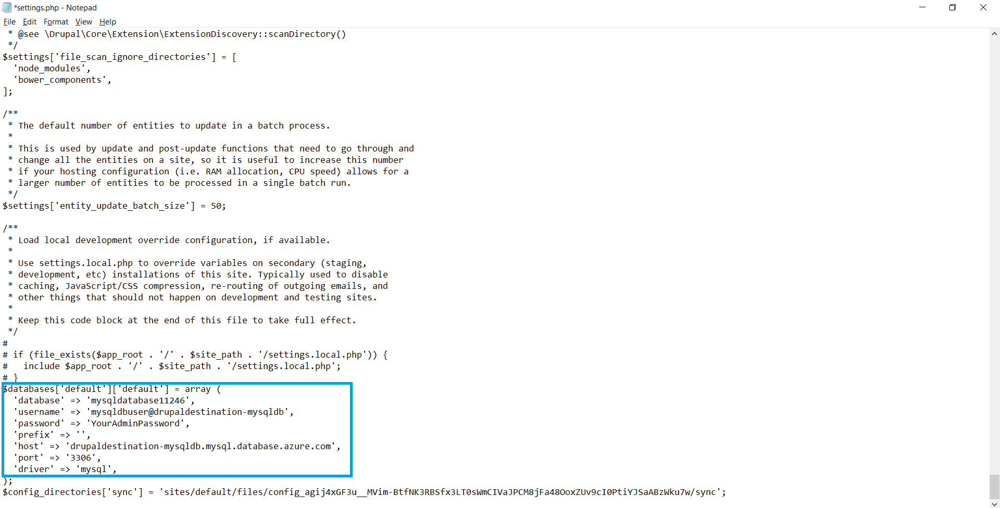

6.  Save the changes to the file

## **Verify Site**

-   You can test the functionality of your new website by navigating to
    the app service in the Azure portal and clicking the **Browse**
    button.

-   Your Drupal site, content, themes and media will now be present at
    the URL.

    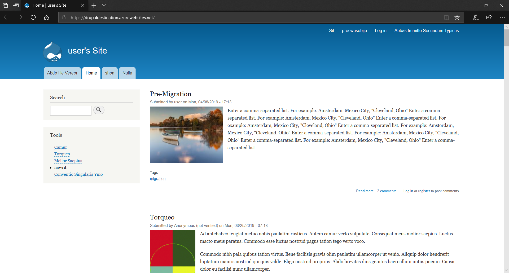

## **Next Steps**

-   [Buy and configure an SSL certificate for Azure App Service](https://docs.microsoft.com/en-us/azure/app-service/web-sites-purchase-ssl-web-site)

-   [Buy a custom domain name for Azure App Service](https://docs.microsoft.com/en-us/azure/app-service/manage-custom-dns-buy-domain)
