# **How to Migrate LAPP Web Stack (PostgreSQL) into Linux App Service**

## **Prerequisites**

-   A Source Application using the **LAPP** stack (Linux, Apache,
    PostgreSQL, PHP). You will need administrative access to the site
    files and PostgreSQL database.

## **Overview**

-   The two key components of most sites are the **Site Files** and
    **Database** (in this case PostgreSQL).

-   We have a very basic task app that connects to a local PostgreSQL
    instance.

-   In this scenario we will move the Site Files and Database from the
    existing installation to the Azure Web App for Containers Service.

    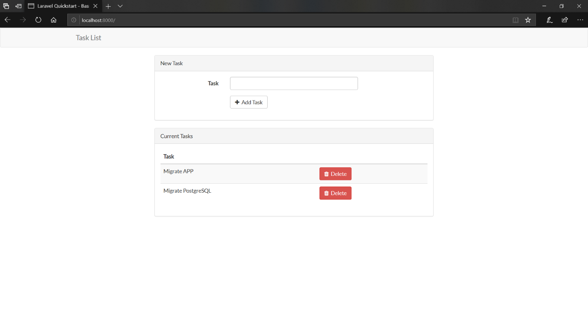

## **Create an App Service plan, empty Web App for Containers instance, and PostgreSQL instance**

-   Create an App Service plan

    1.  Open the **Cloud Shell** from the Azure portal by clicking the **`>_`** button near the bell icon.

        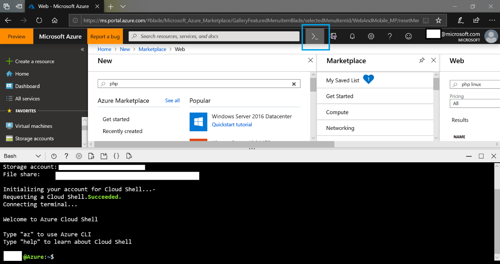

2.  In the Cloud Shell, create an App Service plan with the following command

    ```azure-cli
    az appservice plan create --name myAppServicePlan --resource-group myResourceGroup --sku B1 --is-linux
    ```
    -   The following example creates a Linux App Service plan named lappdestination in the B1 tier.

        ```azure-cli
        az appservice plan create --name lappdestination --resource-group lappdestination --sku B1 --is-linux
        ```

    -   Note if you tab complete after sku you can see a list of available app service plans. For more information see [App Service Plans.](https://azure.microsoft.com/en-us/pricing/details/app-service/plans/)

        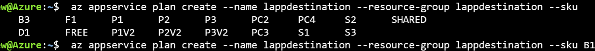

3.  Once complete a summary of the created app service plan will
    display. **Do not** close the Cloud Shell.

-   Create the app service

    1.  In the Cloud Shell enter the following command. This creates an app service called lappdestination and sets the runtime to PHP 7.2.

        ```azure-cli
        az webapp create --resource-group myResourceGroup --plan myAppServicePlan --name <app-name> --runtime "PHP|7.2"
        ```

    -   Example:
        ```azure-cli
        az webapp create --resource-group lappdestination --plan lappdestination --name lappdestination --runtime "PHP|7.2" 
        ```

    2.  Once complete a summary of the created app service plan will display.


-   Create PostgreSQL instance

    1.  Click the following link begin: <https://ms.portal.azure.com/#create/Microsoft.PostgreSQLServer>

    2.  Specify a Server name, Server admin login, admin password, and resource group.

        -   Make a note of the admin credentials as these will be needed later.

    3.  Click **Create**.

        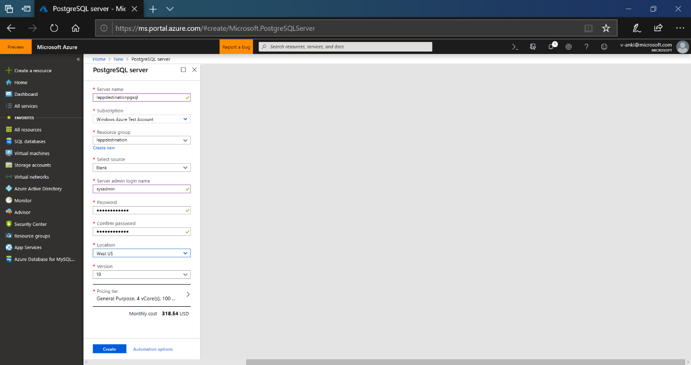

## **Connect to your existing server with FTP, and download site files**

1.  Connect to your existing server. We are using FTP with the FileZilla client. You may have different tools available depending on your hosting provider.

2.  Identify your site directory. In Apache these are normally locate under the "htdocs" directory. In our case the directory location is `"/opt/bitnami/apache2/htdocs/laravel-tasks"`.

    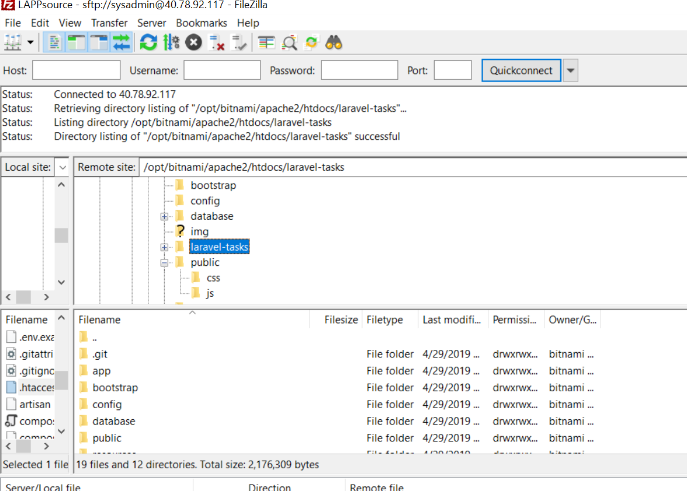

3.  Download the site directory.

4.  You now have a copy of your site files.

## **Connect to your existing PostgreSQL instance and create a .Dump file.**

1.  Connect to your source database server via console or SSH.

2.  To back up an existing PostgreSQL database on-premises or in a VM, run the following command:

    ```azure-cli
    pg_dump -Fc -v --host=<host> --username=<name> --dbname=<database name> > <database>.dump
    ```

    b.  Example with localhost: 
    ```azure-cli
    pg_dump -h localhost -U postgres -Fc -d lappdb > lappdbbackup.dump
    ```

3.  The file can be named and located as needed. In our example the file is put into the root the working directory.

4.  Remain connected to your source database.

## **Connect to your Azure PostgreSQL instance to create destination database.**

1.  In the Azure portal navigate to the PostgreSQL instance you created.

2.  Under Connection security add a rule to allow access to this
    instance from your source machine.

    a.  In our example the public address for our source server is 40.78.92.117.

3.  Set the **Allow access to Azure services slider** to **ON**. This
    only allows connections from Azure services (including your web app), but for security you may want to restrict this to the IP of your web app. By default, the web app has a dynamic address, so additional configuration is needed.

    a.  For more information see [Inbound and outbound IP addresses in Azure App Service.](https://docs.microsoft.com/en-us/azure/app-service/overview-inbound-outbound-ips)

4.  Scroll down **SSL settings** and change **Enforce SSL connection** to disabled.

    a.  For more information on configuring and enabling SSL for
        PostgreSQL see [postgresql concepts-ssl-connection-security](https://docs.microsoft.com/en-us/azure/postgresql/concepts-ssl-connection-security)

    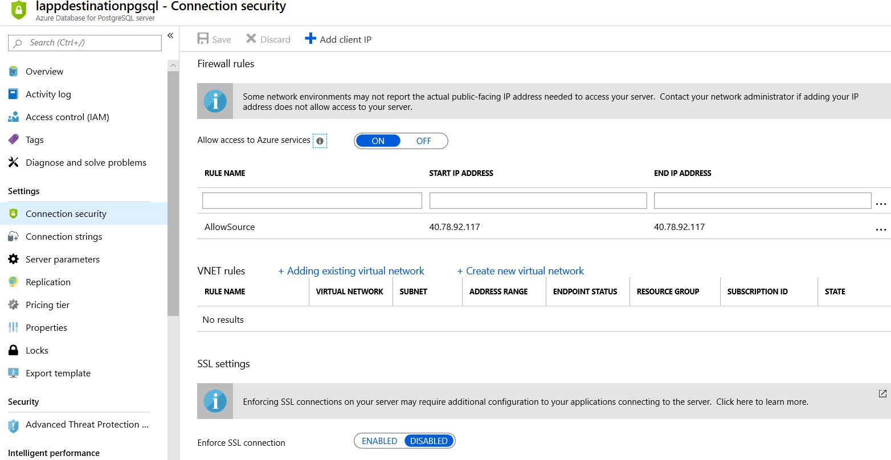

5.  Locate your database connection information. This can be located on the overview page.

    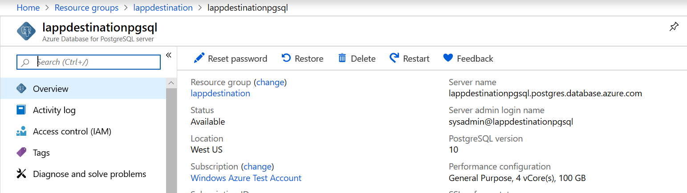

6.  While still on the source PostgreSQL server run the following
    command to connect remotely to your Azure instance. **Host** will be your full **Server name**, and **Username** will be the **Server admin login name**. (Note that the **dbname** will usually need to be set to **postgres**. An existing database must be specified and this one is normally created by default.)

    ```azure-cli
    psql --host=<yourserver> --port=<port> --username=<server admin login> --dbname=postgres
    ```

    Example: 
    ```azure-cli
    psql --host=lappdestinationpgsql.postgres.database.azure.com --port=5432 --username=sysadmin@lappdestinationpgsql --dbname=postgres
    ```

7.  When prompted for the password enter the database password created
    earlier.

8.  Once connected run the following command to create the database

    a.  `CREATE DATABASE mypgsqldb;`

    b.  Example: `CREATE DATABASE lappdb;`

9.  Enter the following command to exit psql.

    `/q`

10. The destination database has been created. Remain connected your source server.

## **Restore to Azure PostgreSQL database**

1.  Run the following command to restore the database.

    ```azure-cli
    pg_restore -v --no-owner –-host=<server name> --port=<port> --username=<user@servername> --dbname=<target database name> <database>.dump
    ```

    -  Example:
    ```azure-cli
    pg_restore -v --no-owner --host=lappdestinationpgsql.postgres.database.azure.com --port=5432 --username=sysadmin@lappdestinationpgsql --dbname=lappdb lappdbbackup.dump
    ```

    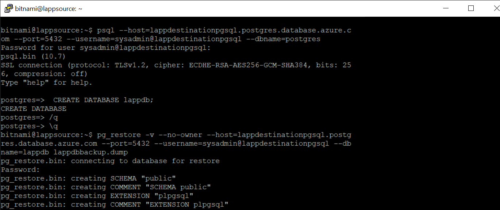

c.  Once the command completes the database has been migrated.

## **Update database connection settings and Upload site files.**

1.  Return to the site files you downloaded earlier.

2.  Find the file that contains your sites connection string.

3.  In our example the setting is configured in a .env file.

4.  Update:

    a.  DB_HOST to your full server name.

    b.  DB_USERNAME to the server admin login name.

    c.  DB_PASSWORD to the password for the new server.

    -  DB_DATABASE may need to be updated if the database name changed. In our example this stays the same.

        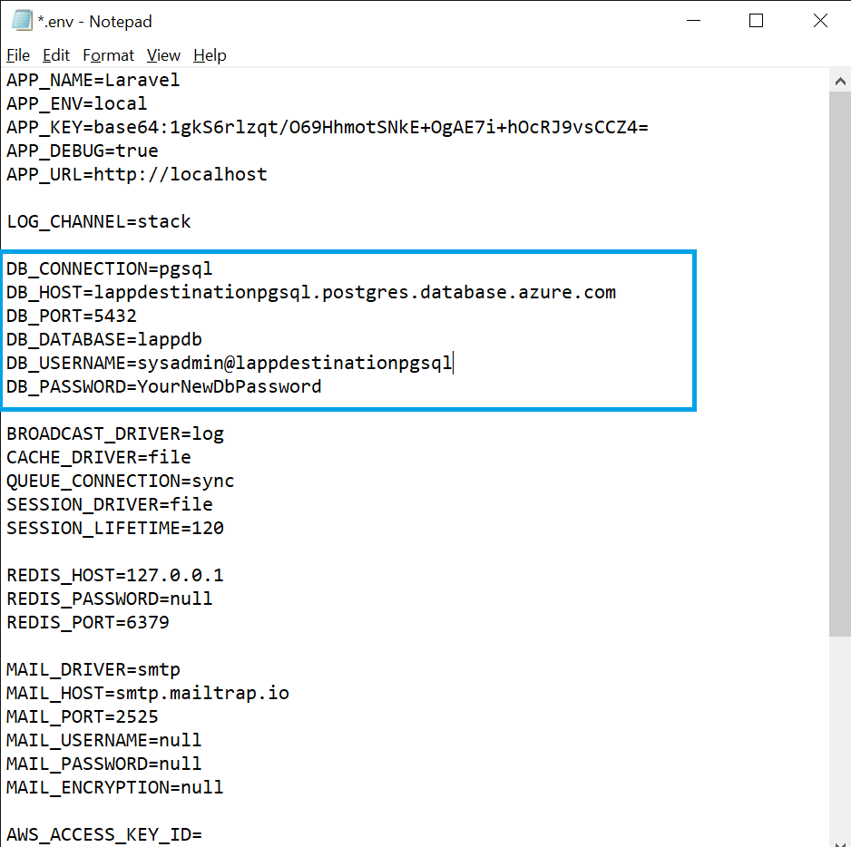

5.  Save the changes and connect to the Web App Using FTP.

6.  The FTP connection information can be found on the overview page for the web app in the Azure portal

    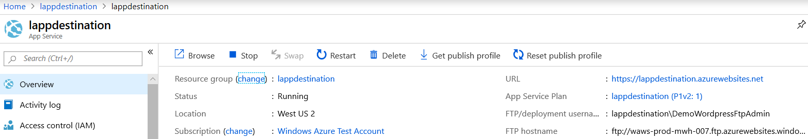

7.  Once connected navigate to the directory /site/wwwroot

8.  Copy the Site files into this directory.

    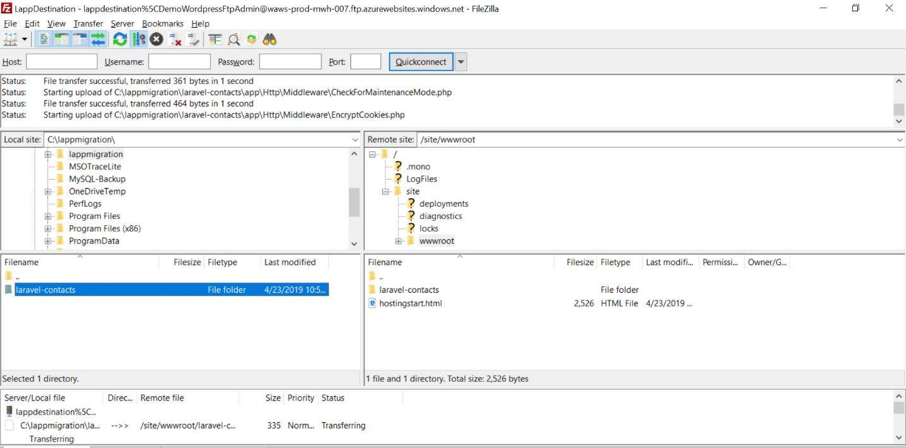

9.  You should now be able to navigate to the URL of your Azure web app. This can be found under the overview of the web app.

    

10. The previous entries from the previous day are present. I was able to create a new entry without issue.

## **Next Steps:**

-   As noted, there are additional security measures you may want to consider implementing. See the below link for more information.

    -   <https://docs.microsoft.com/en-us/azure/app-service/overview-security>

    -   [Buy and configure an SSL certificate for Azure App
    Service](https://docs.microsoft.com/en-us/azure/app-service/web-sites-purchase-ssl-web-site)

    -   [Buy a custom domain name for Azure App
    Service](https://docs.microsoft.com/en-us/azure/app-service/manage-custom-dns-buy-domain)
