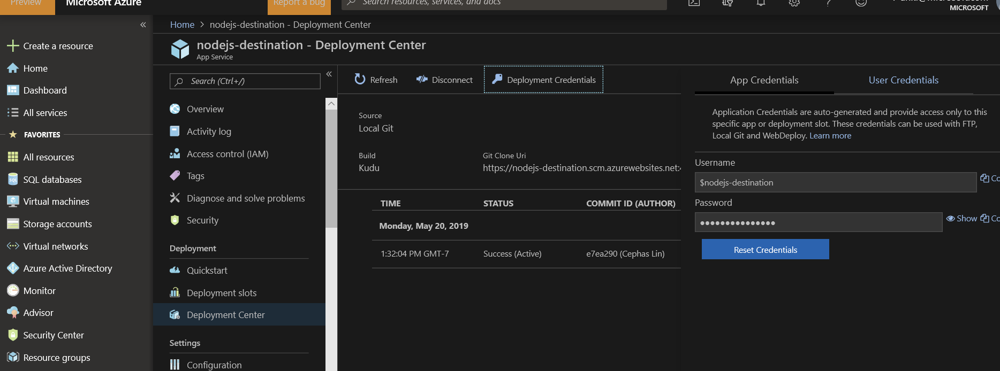

# **How to Migrate a MEAN Application Stack (MongoDB, Express, AngularJS, and Node.js) in Azure Linux Web App**

## **Prerequisites**

-   A Source Application using the MEAN application stack (MongoDB,
    Express, AngularJS, and Node.js). You will need administrative
    access to the site files and Mongo database.

## **Overview**

-   The two key components of most sites are the **Site Files** and
    **Database** (in this case MongoDB).

-   We have a very basic task app that connects to a local MongoDB
    instance.

-   In this scenario, we will deploy the Site Files using git and
    connect to the MongoDB database migrated to Azure Cosmos.

    

## **Create an App Service plan, empty Web App for Containers instance, and MongoDB instance**

-   **Create an app service plan**

    1.  Open the cloud shell from the Azure portal by clicking the **\>\_** button near the bell icon.

        

    2.  In the Cloud Shell create a resource group with the following command.

        ```azure-cli
        az group create --name myResourceGroup --location "West Europe"
        ```

    3.  create an App Service plan with the following command.

        ```azure-cli
        az appservice plan create --name myAppServicePlan --resource-group myResourceGroup --sku B1 --is-linux
        ```

    4.  Once complete a summary of the created app service plan will display. **Do not** close the cloud shell.

-   **Create a web app**

    5.  In the Cloud Shell, you can use the [az webapp
        create](https://docs.microsoft.com/en-us/cli/azure/webapp?view=azure-cli-latest)
        command. In the following example, replace \<app-name\> with a
        globally unique app name (valid characters are a-z, 0-9, and -).
        The runtime is set to NODE\|6.9. To see all supported runtimes,
        run [az webapp list-runtimes
        \--linux](https://docs.microsoft.com/en-us/cli/azure/webapp?view=azure-cli-latest).

        ```azure-cli
        az webapp create --resource-group myResourceGroup --plan myAppServicePlan --name <app-name> --runtime "NODE|6.9" --deployment-local-git 
        ```

    6.  Once complete a summary of the created app service plan will display.

-   **Create a Cosmos DB account**

    7.  In the Cloud Shell, create a Cosmos DB account with the [az cosmosdb create](https://docs.microsoft.com/en-us/cli/azure/cosmosdb?view=azure-cli-latest#az-cosmosdb-create)
        command.

    8.  In the following command, substitute a unique Cosmos DB name for
        the *\<cosmosdb-name\>* placeholder. This name is used as the
        part of the Cosmos DB endpoint,
        https://\<cosmosdb-name\>.documents.azure.com/, so the name
        needs to be unique across all Cosmos DB accounts in Azure. The
        name must contain only lowercase letters, numbers, and the
        hyphen (-) character, and must be between 3 and 50 characters
        long.

        ```azure-cli
        az cosmosdb create --name <cosmosdb-name> --resource-group myResourceGroup --kind MongoDB 
        ```

    9.  The *\--kind MongoDB* parameter enables MongoDB client
        connections.

-   **Migrate the database**

    10. See [Tutorial: Migrate MongoDB to Azure Cosmos DB\'s API for MongoDB offline using DMS](https://docs.microsoft.com/en-us/azure/dms/tutorial-mongodb-cosmos-db)

    11. Once complete proceed with the next steps.

## **Connect your web app to the migrated Azure Cosmos database**

-   In this step, you connect your application to the Cosmos DB database you just created, using a MongoDB connection string.

-   **Retrieve the database key -** To connect to the Cosmos DB
    database, you need the database key. In the Cloud Shell, use the `az cosmosdb list-keys` command to retrieve the primary key.

    ```azure-cli
    az cosmosdb list-keys --name <cosmosdb-name>
    ```

    12. The Azure CLI shows information similar to the following example:

        ```json
        {  "primaryMasterKey": "RS4CmUwzGRASJPMoc0kiEvdnKmxyRILC9BWisAYh3Hq4zBYKr0XQiSE4pqx3UchBeO4QRCzUt1i7w0rOkitoJw==",  "primaryReadonlyMasterKey": "HvitsjIYz8TwRmIuPEUAALRwqgKOzJUjW22wPL2U8zoMVhGvregBkBk9LdMTxqBgDETSq7obbwZtdeFY7hElTg==",  "secondaryMasterKey": "Lu9aeZTiXU4PjuuyGBbvS1N9IRG3oegIrIh95U6VOstf9bJiiIpw3IfwSUgQWSEYM3VeEyrhHJ4rn3Ci0vuFqA==",  "secondaryReadonlyMasterKey": "LpsCicpVZqHRy7qbMgrzbRKjbYCwCKPQRl0QpgReAOxMcggTvxJFA94fTi0oQ7xtxpftTJcXkjTirQ0pT7QFrQ=="}
        ```

    13. Copy the value of **primaryMasterKey**. You need this
        information in the next step.

-   **Configure the connection string in your Node.js application**

    14. For your Azure app, you use app settings to define your MongoDB connection string. To set app settings, use the [az webapp config appsettings set](https://docs.microsoft.com/en-us/cli/azure/webapp/config/appsettings?view=azure-cli-latest#az-webapp-config-appsettings-set) command in the Cloud Shell.

    15. The following example configures a MONGODB_URI app setting in your Azure app. Replace the `<app-name>`, `<cosmosdb-name>`, `<primary-master-key>`, and `<CollectionName>` placeholders.

        ```azure-cli
        az webapp config appsettings set --name <app-name> --resource-group myResourceGroup --settings MONGODB_URI="mongodb://<cosmosdb-name>:<primary-master-key>@<cosmosdb-name>.documents.azure.com:10250/<CollectionName>?ssl=true"
        ```


-   **Connect Push the app from your local repository to Azure app service using git**

    16. Retrieve the deployment credentials from the Azure portal. Navigate to your app service **\>** **Deployment Center.** The Git URI and login credentials can be retrieved from here.

        

    17. Connect to your source web server via console or SSH.

    18. Add an Azure remote to your local Git repository. Replace `<deploymentLocalGitUrl-from-create-step>` with the URI

        ```azure-cli
        git remote add azure <deploymentLocalGitUrl-from-create-step>
        ```

    19. Push to the Azure remote to deploy your app with the following command. When prompted for credentials by Git Credential Manager, make sure that you enter the credentials you use from the previous step.

        `git push azure master`

    20. This command may take a few minutes to run. While running, it displays information similar to the following example:

    

    25. Once the push completes you will see a successful deployment similar to screenshot below.

        

## **Test the web app**

You should now be able to navigate to the URL of your Azure web app. This can be found under the **Overview** of the web app.


The web app is now running in the Azure App Service with Cosmos database.

## **Next Steps:**

-   <https://docs.microsoft.com/en-us/azure/app-service/overview-security>

-   [Buy and configure an SSL certificate for Azure App
    Service](https://docs.microsoft.com/en-us/azure/app-service/web-sites-purchase-ssl-web-site)

-   [Buy a custom domain name for Azure App
    Service](https://docs.microsoft.com/en-us/azure/app-service/manage-custom-dns-buy-domain)
