# **Test Deployment & Migration Instructions**

## **Overview**

In this scenario you will use ARM a template to configure VM's and other
resources for a test environment, then migrate a test site using the
**App Service Migration Assistant Tool.**

## **Pre-Requisites**

-   An active Azure Subscription.

## **Create the Virtual Machines in Azure**

1.  Begin by navigating to the Git-Hub Repository for the ARM template.

    a.  <https://github.com/AppServiceDemo/AppWorkshop>

2.  Click the Link to "**Deploy to Azure**".

    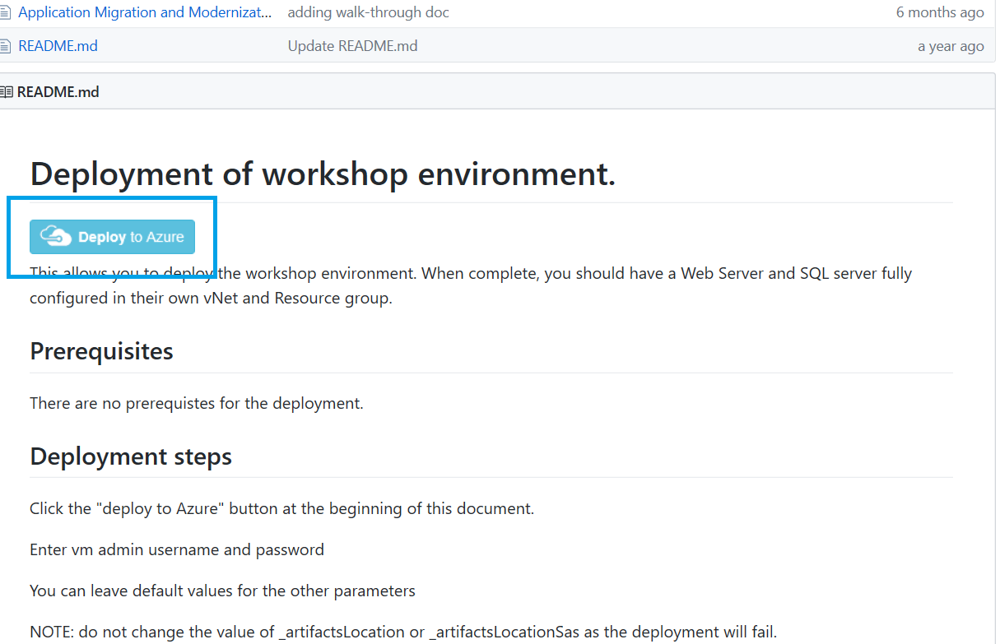

3.  Login with your Azure credentials. Note: If you are already logged
    into the Azure portal you will be directed directly Custom
    Deployment screen.

    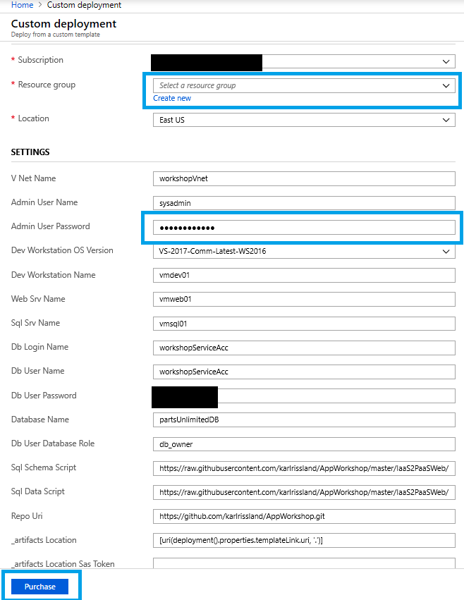

4.  Once you are at the Custom Deployment screen.

    a.  Select an **existing resource group** or **create a new one**

    b.  Make note of the Administrator account name and set a password
        for the account.

5.  The remaining settings can be left at default.

6.  Check agree to terms and conditions, then click "Purchase". This
    will begin the creation of VM's and other resources needed.

7.  In the Azure portal navigate to the resource group that you deployed
    the template to.

8.  **Under Settings \>** Deployments Find the Microsoft. Template
    deployment. This shows the status of the deployment.

    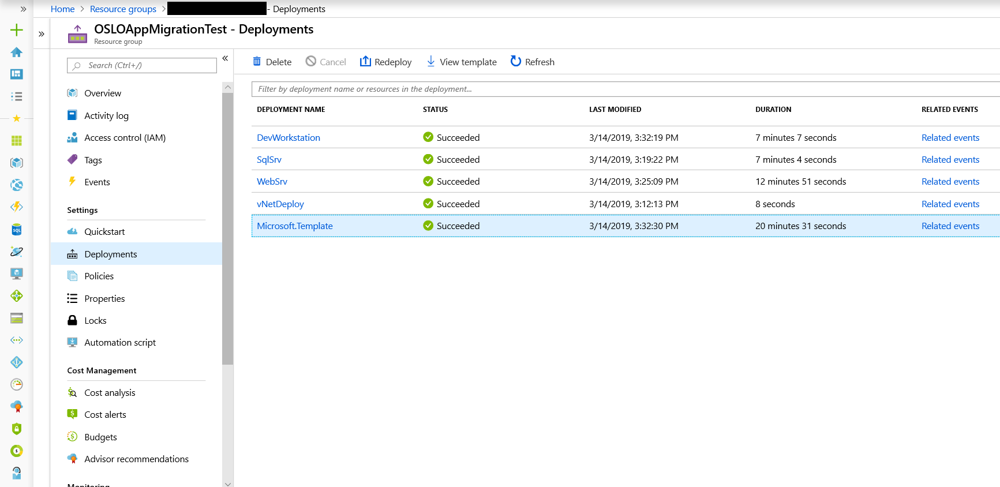

9.  When the deployment status shows as succeeded, the resources are
    ready for use.

## **Connect to the Azure the VM Web Server**

1.  Navigate to the **Virtual machines** blade in the Azure portal.

2.  Find the **vmweb01** machine and click the machine name to bring up
    the overview page.

    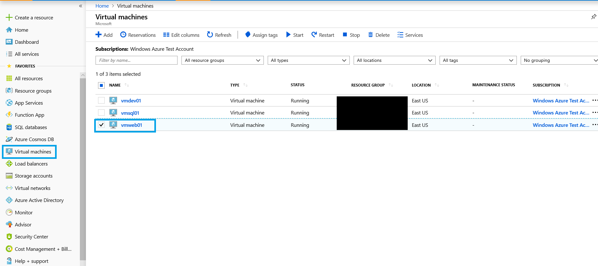

3.  Click Connect in the upper left portion of the window.

    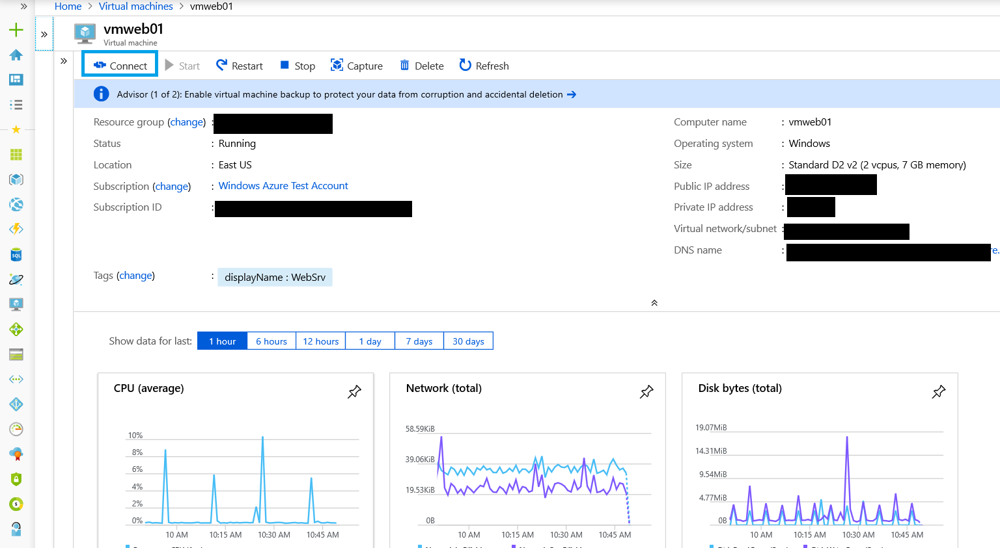

4.  In the Connect to Virtual Machine Window click download to download
    the RDP file. Choose **Save** when the download begins.

    

5.  Once the download completes double click the file. You will be
    prompted to enter your credentials. The credentials will default to
    the domain associated with your local machine. Choose **Use a
    different account**.

    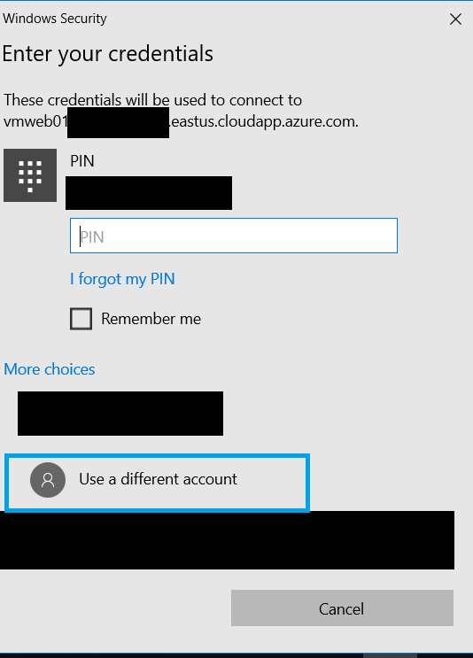

6.  After selecting Use a different Account. Type in the username field "**vmweb01\\sysadmin**" and then enter the password you created earlier then click OK.

7.  The remote connection will begin. You may be prompted with a certificate warning. Click yes to proceed.

8.  You are now connected to **vmweb01.**

9.  Open the web browser type in localhost. If the site is successfully running, you should see a page like the screenshot below.

    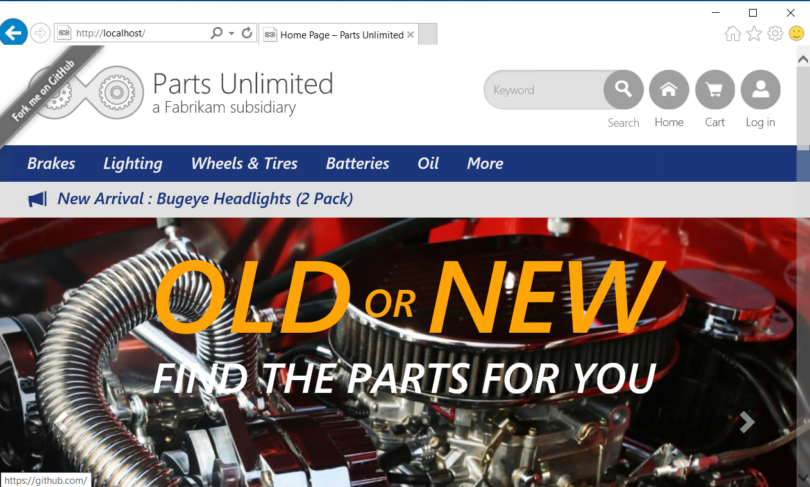

## **Migrate Using the App Service Migration Assistant Tool**

1.  Disable Internet Explorer Enhanced security and Enable downloads.

    a.  To disable IE Enhanced Security

    1.  On **vmweb01** Open ***Server Manager > Local Server > IE Enhanced Security Configuration***, then find the link to ***disable IE enhanced security***.

    b.  To enable downloads:

    2.  Clicking the gear icon in the upper right hand of the menu bar.

    3.  Click Internet options.

    4.  Click the Security tab.

    5.  Click Custom level.

    6.  Find File Download setting and change from Disabled to Enabled.

2.  Navigate to the below URL on the **vmweb01**

    [https://appmigration.microsoft.com/](https://appmigration.microsoft.com/)

3.  Click the "Download" button on the right.

4.  Click the "Download" link and accept terms to begin downloading the tool.

5.  Note: Once the download completes, run the **MSI installer** (Note:
    Installation will only succeed for the system administrator account)

6.  Once the installation completes the tool can be launched from the
    desktop shortcut "AppServiceMigrationAssistant".

7.  The tool should automatically detect the website and display below.

    a.  If the website is not listed attempt to reload the tool

    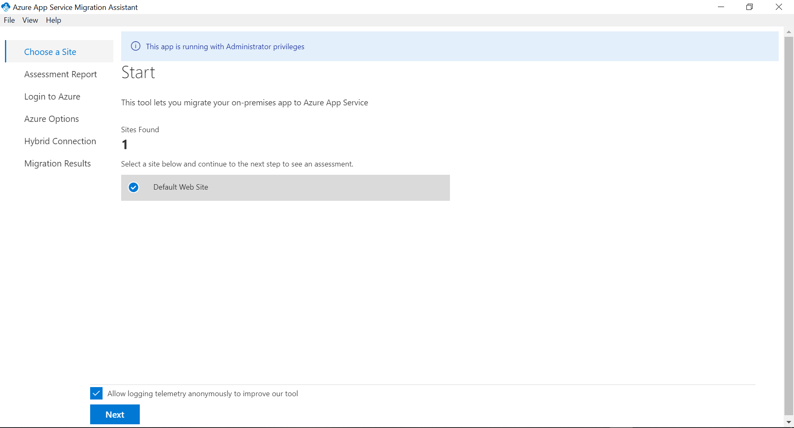

8.  Select the site you wish to migrate and click **Next**.

9.  This will return the results of the pre-migration readiness checks.

10. Errors need to be resolved prior to migration. Warnings indicate
    that while the migration can proceed, but there may be additional
    configuration steps required outside of the App Service Migration
    Assistant Tool. For more information see [Azure App Service Migration Readiness Checks.](https://appmigration.microsoft.com/readinesschecks)

    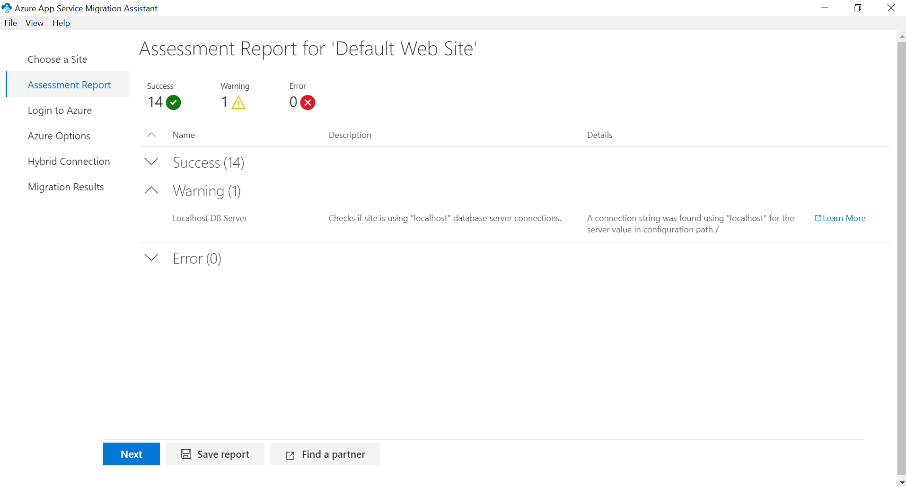

11. Click **next** to proceed.

12. You will now be at the Login to Azure page.

    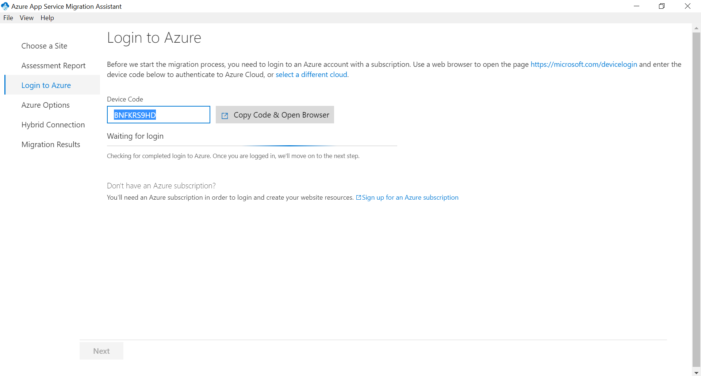

13. Click **Copy Code & Open Browser** next to the device code. Then
    click **Next**. This will launch the default a browser window. Due
    to Internet Explorer Enhanced security you will have to click add,
    to add the site as trusted. Once this is complete you should see a
    page like the one below.

    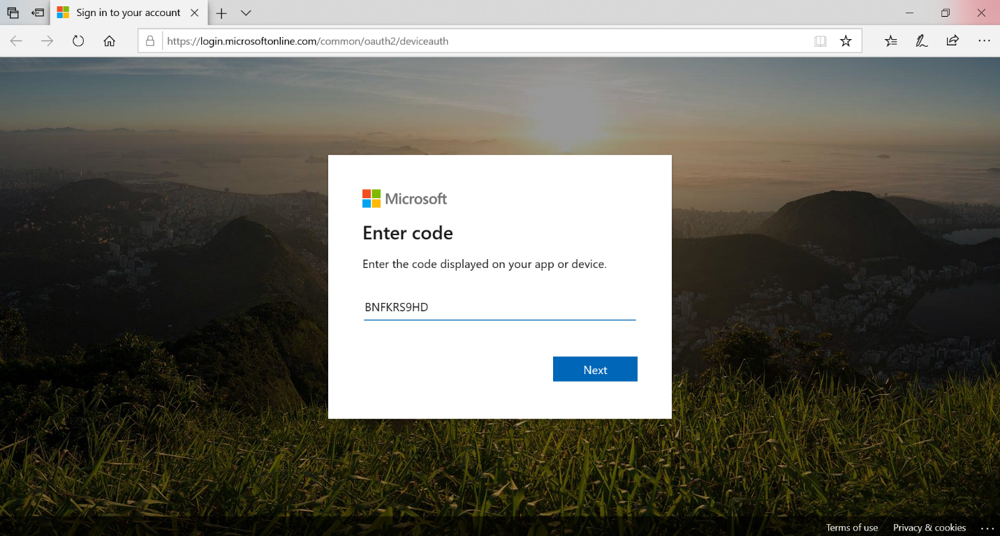

14. Press the **Ctrl-V** key to paste the code into the field. Once the
    code is entered, click **Next** to continue. Note: This code expires
    after 10 minutes. If the code is not accepted proceed back to the
    assessment phase, then click next to generate a new code.

15. You will be prompted to login with your Azure account. Once you have
    logged in you should see a success message.

    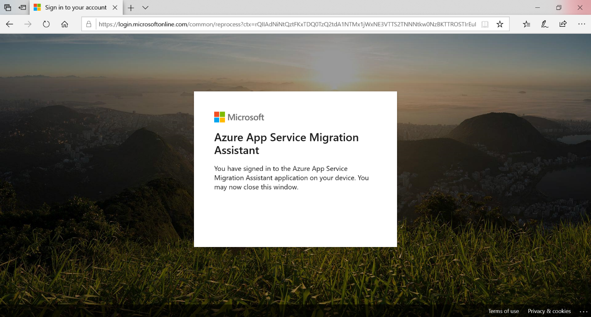

16. You may now close the browser and proceed back to the migration
    assistant tool.

17. You will now need to enter a device code for your tenant. The steps
    are identical to the previous step. Once the second login sign in is
    complete, proceed back to the tool. The tool will have advanced to
    the Azure Options page.

18. Fill in the options below.

    a.  Subscription.

    b.  Resource Group.

    c.  Destination Site Name.

    d.  Region.

    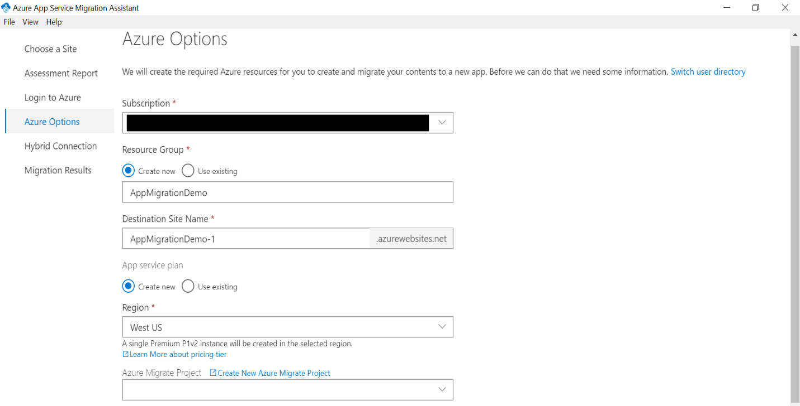

19. The last task on this page is to configure the database. You will
    need to choose between setting up a **hybrid connection** to your
    on-premises database or skipping the database setup for now. We are
    choosing to setup the hybrid connection to our on-premises database.

20. The tool will detect any connection settings from the web.config for
    the database. Click **Migrate** to proceed.

21. You will now be on the Setup **Hybrid Connection Manager** page.

22. You will now be in the Migration Progress screen. Note this may take
    some time depending on the size of your site and other factors.

    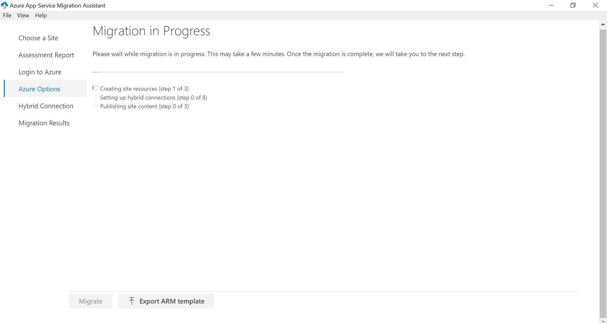

23. Once the migration completes you will need to setup the hybrid connection. On the **Setup Hybrid Connection Manager** page, click the link to download the MSI for installation.

    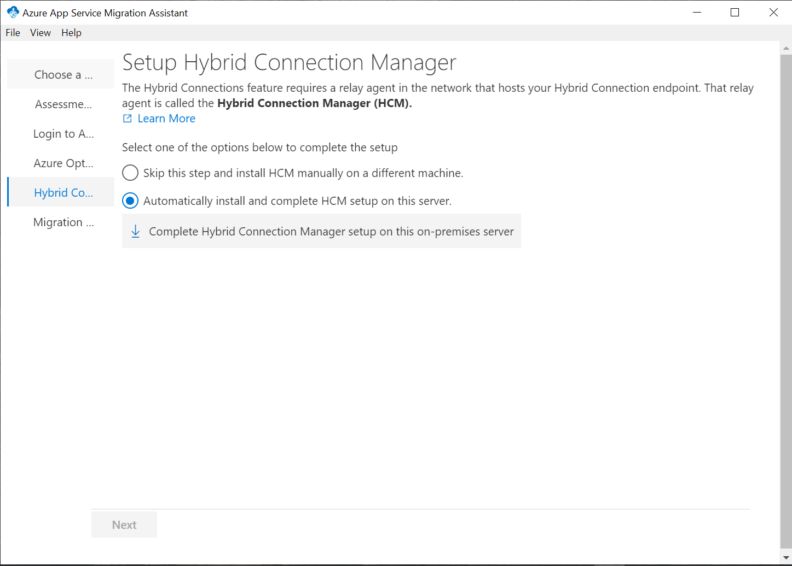

24. Once the download completes, run the MSI installer. Click the box to
    accept the license terms then click install. Note: The installer
    will now complete without any further configuration actions needed.

25. Once the Hybrid Connection Manager Completes installation the App
    Service Migration Assistant Tool should report success.

    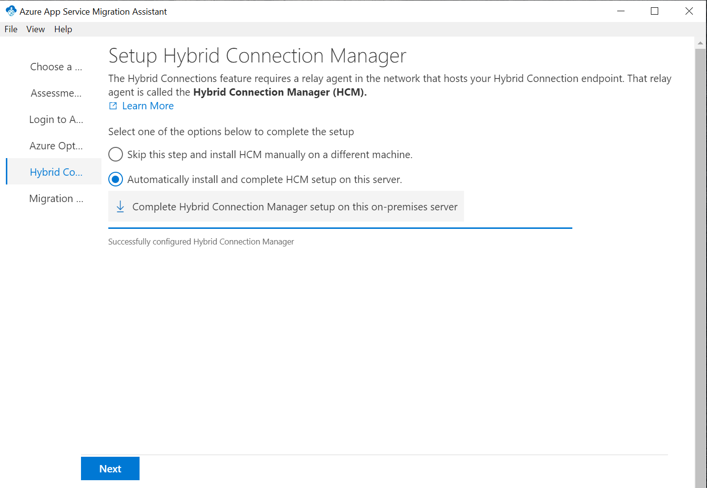

26. Click **Next** to view migration results page.

    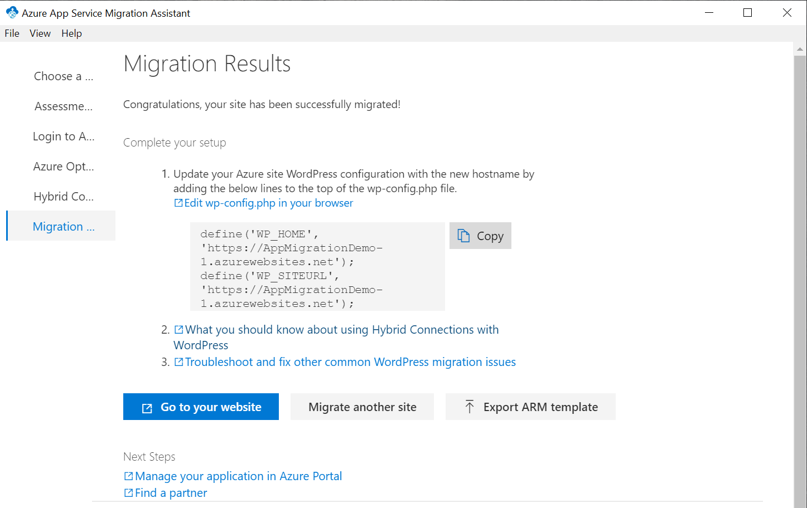
    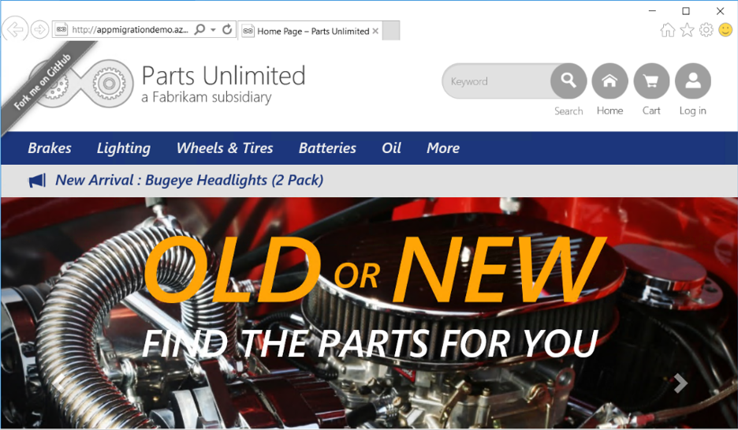

27. The migration is now complete. Click **Go to your website**. The migrated site should display.

