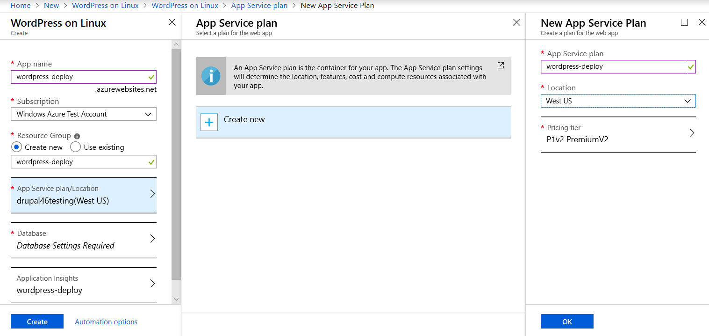
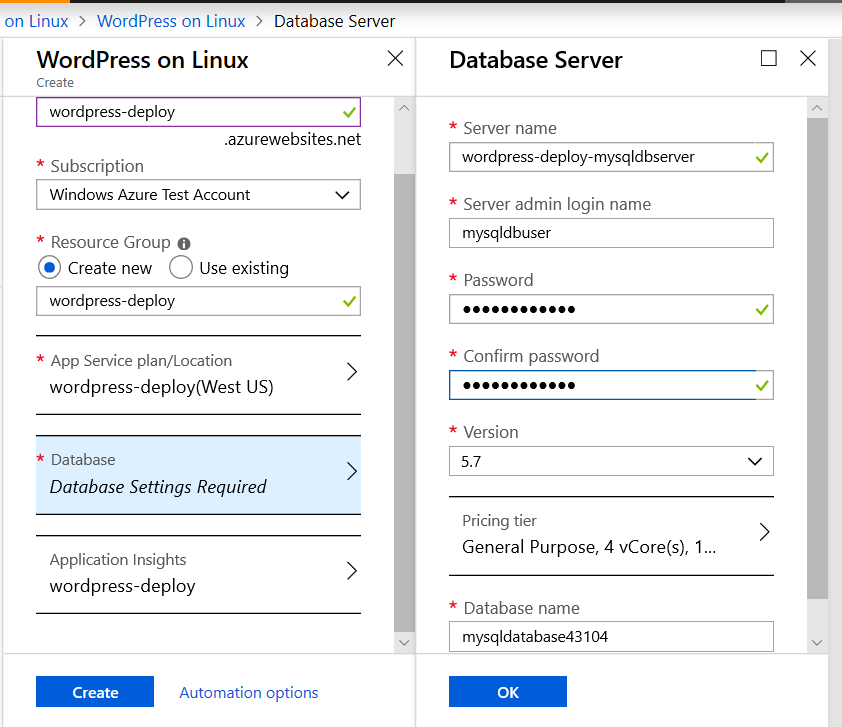
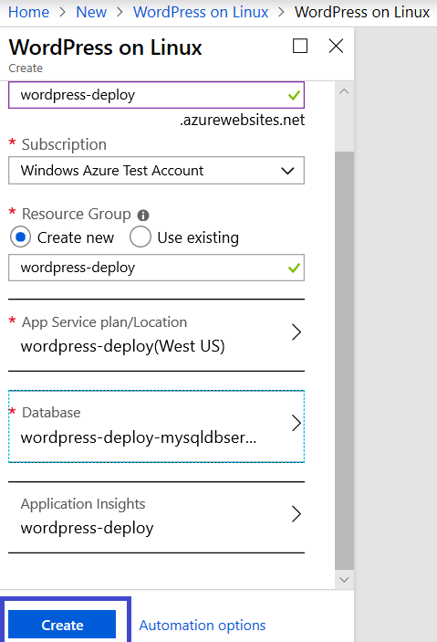
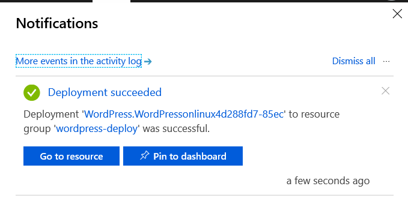
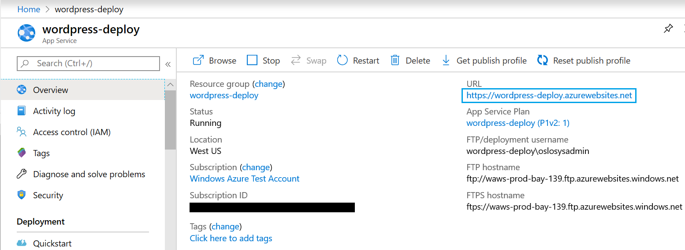
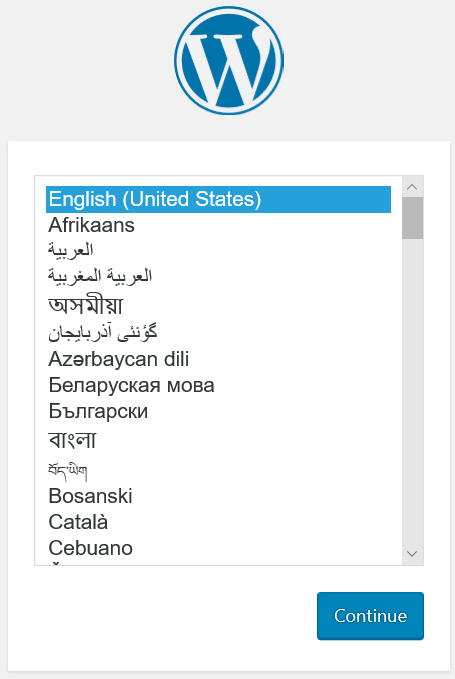
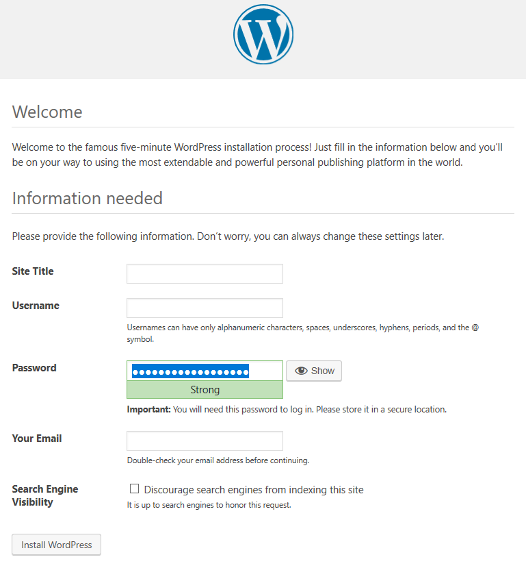
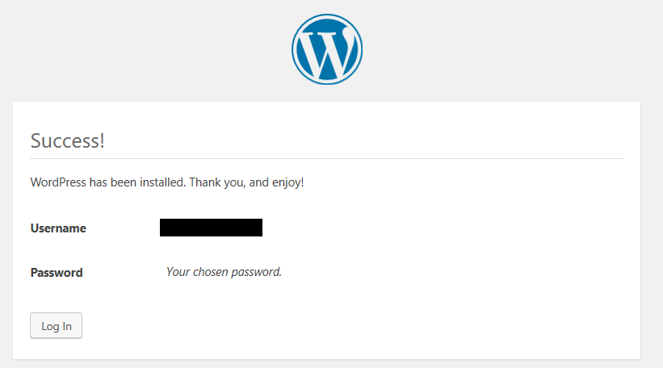
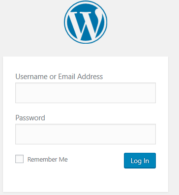
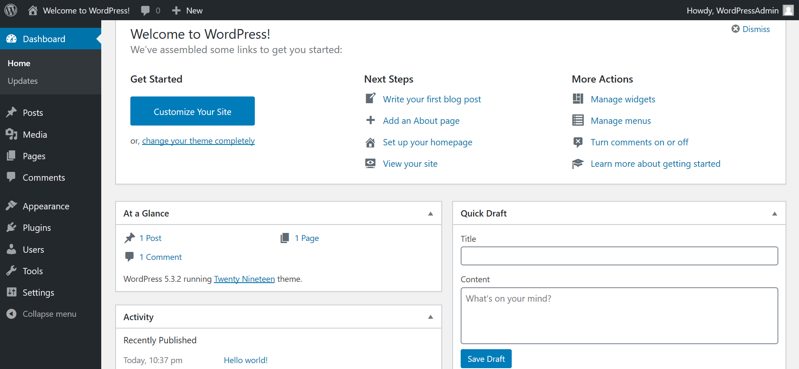

# **How to deploy WordPress into Linux App Service using Marketplace Template**

## **Create the App Service**

1.  Click the following link to begin the process of creating the APP service in your tenant. This will bring you to the **WordPress on Linux \> Create** page.
    [https://ms.portal.azure.com/#create/WordPress.WordPressonlinux](https://ms.portal.azure.com/#create/WordPress.WordPressonlinux)

2.  Create an **APP Name**. Select **Use Existing** or C**reate New**
    resource group. Click the **App Service plan/Location** blade to
    specify the App Service Plan. Click the **Create New** button.

3.  In the **New App Service Plan** window enter a name for the service plan, enter the desired location, and pricing tier.

    

4.  Click the **Database** blade.

5.  Enter the desired settings for your MySQL instance. Then click
    **OK.**

    

6.  Click **Create.**

    

7.  Once the deployment completes, you will see a "**Deployment succeeded**" message in the notification's menu.

    

8.  Click the **Go to resource** button. This brings you to the **App Service Overview**.

    

9.  From here click the **URL** link to navigate to your site. You should see a page like the one below.

    

10. Click **Continue** to begin the initial WordPress install.

    **Note:** These are the standard steps for installing WordPress. For more in-depth information consult WordPress documentation at [Installing WordPress](https://codex.wordpress.org/Installing_WordPress).

    

11. On the Installation page enter the required information. Make note of the password. Then click **Install WordPress.**

12. You should see a success page.

    

13. Click the **Log In** button.

14. This brings you to the administration page login.

    a.  Note For future use this page can be accessed with
        http://\[WebApp URL\]//wp-login.php

    

15. Enter the credentials you created. Then click **Log In.**

    

16. You are now logged in.

