# **How do I migrate an existing WordPress app to Azure Web App for Containers in Linux?**

## **Prerequisites**

-   An Azure WordPress on Linux App Service to serve as a destination.

-   A Source Linux WordPress installation needing migration. You will
    need administrative access to the site files and MySQL database.

-   MySQL Database Requirements:

    -   Azure Database for MySQL currently only supports versions
        5.6.3.5 and 5.7.1.8 using the InnoDB engine.

    -   If you have MyISAM tables, convert them to InnoDB before
        migration. For more information, see the MySQL article
        [Converting Tables from MyISAM to
        InnoDB.](https://dev.mysql.com/doc/refman/5.6/en/converting-tables-to-innodb.html)

## **Overview**

-   The two key components of your WordPress site are the Site Files and
    MySQL database. In this scenario we will move the Site Files and
    Database from your existing installation to the Azure App Service.

-   We have a basic WordPress site configured on a Linux Virtual
    Machine. We have posts, theme, and media which need to be migrated.

    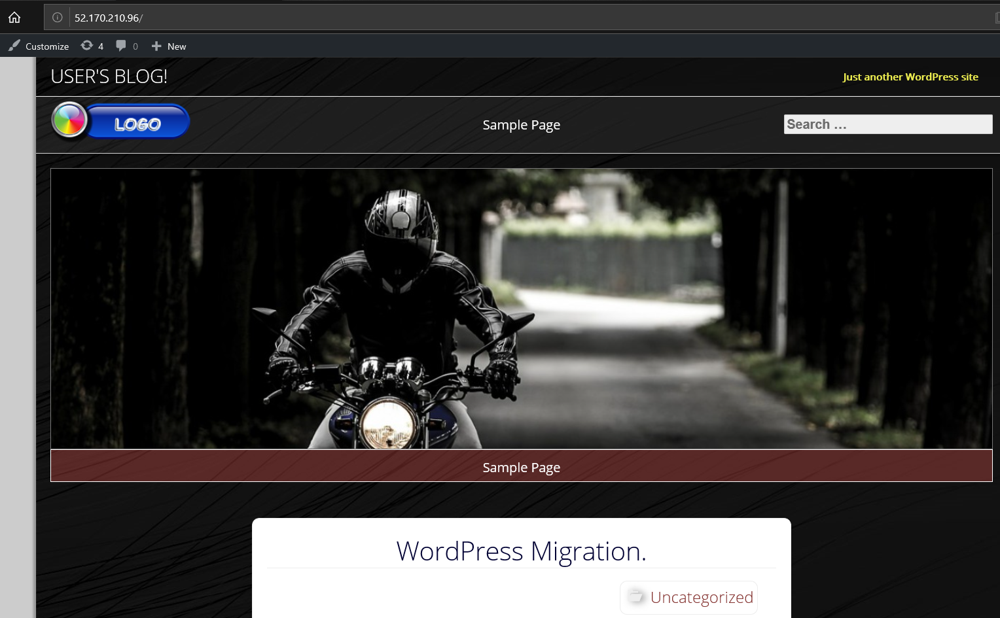

## **Migrate your site files**

### **Download your Site files from your source server.**

1.  Connect to your existing server. We are using FTP with the FileZilla
    client. You may have different tools available depending on your
    hosting provider.

2.  Identify your WordPress site directory. This will contain your
    WP-Content folder, and WP-Config.php. In our case the location is
    "/opt/bitnami/apps/wordpress/htdoc".

    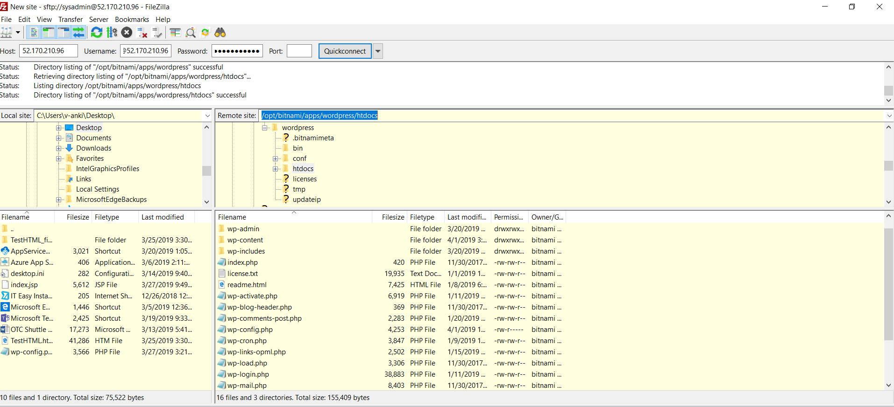

3.  Download the root directory. This may take some time.

4.  Once the download has completed. Find the WP-Config file. Append the
    filename with .OLD. (Note: The Web app generates a WP-Config
    populated with the necessary database connection settings. This
    should work for most situations, but you may want to retain your old
    config file for future reference.)

### **Upload your Site files to your destination App Service.**

5.  Find the **FTPS Hostname** URL and **FTP/Deployment Username** in
    the App service overview. (If you have not created deployment
    credentials, or need to reset the password Click the **Deployment
    Credentials** blade on the left to do this)

    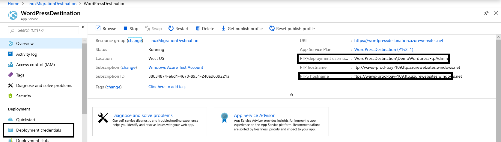

6.  Use an FTP client to connect to the Azure App service site with by
    entering:

    a.  The FTPS URL into the hostname field.

    b.  The Deployment Username into the username field.

    c.  The Deployment Username password into the password field.

    d.  Connect, there may be certificate warning. Click **OK**.

    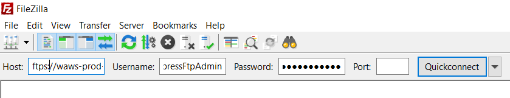

7.  The directory structure will look like the screenshot below.

    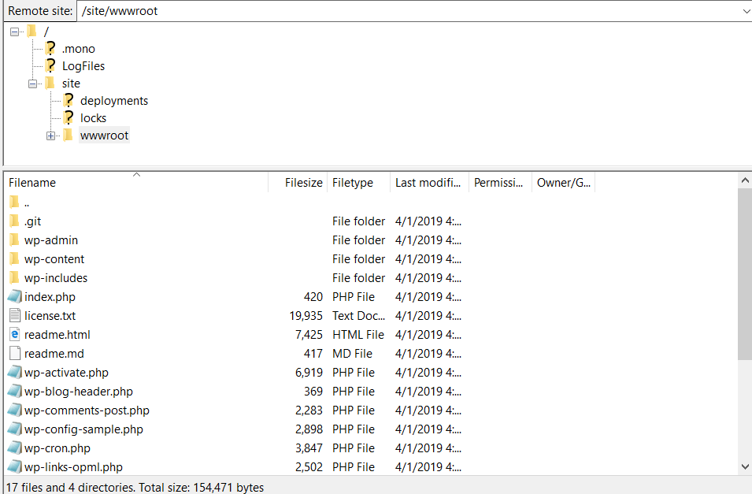

8.  Locate the /site/wwwroot/ directory.

9.  Open the directory you exported from your source site.

    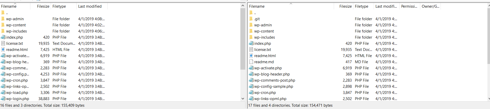

10. Select all your files and upload to Azure web app using FTP. When
    prompted select Overwrite to replace the files in the destination.
    Select "Always use this action", Then click **OK**.

    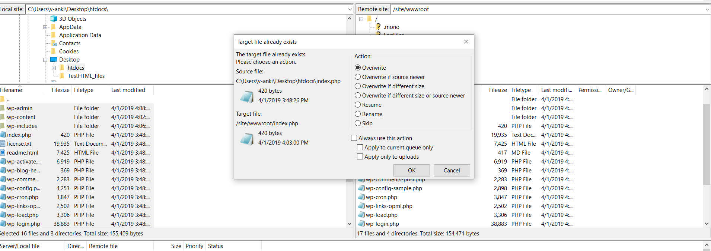

11. The file upload will begin. This may take some time.

## **Backup the MySQL WordPress Database.**

-   For this step we will need MySQL Workbench on your workstation. You
    will also need a login credential and network access to your MySQL
    server on port 3306.

-   If you do not already have MySQL Workbench it can be downloaded
    from. <https://dev.mysql.com/downloads/workbench/>

1.  Open MySQL Workbench and click the **+** icon next to the MySQL
    connection.

    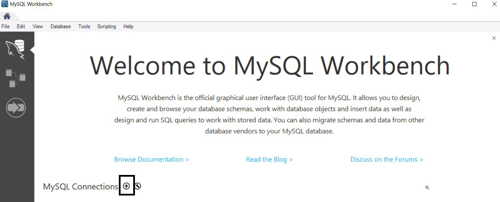

2.  Then enter the connection information. Typically, the IP
    address/hostname of the server running MySQL can be used (Localhost
    if running locally). The username needs to be a user with access to
    the WordPress database remote remotely. Note: the root user may be
    restricted from remote login.

    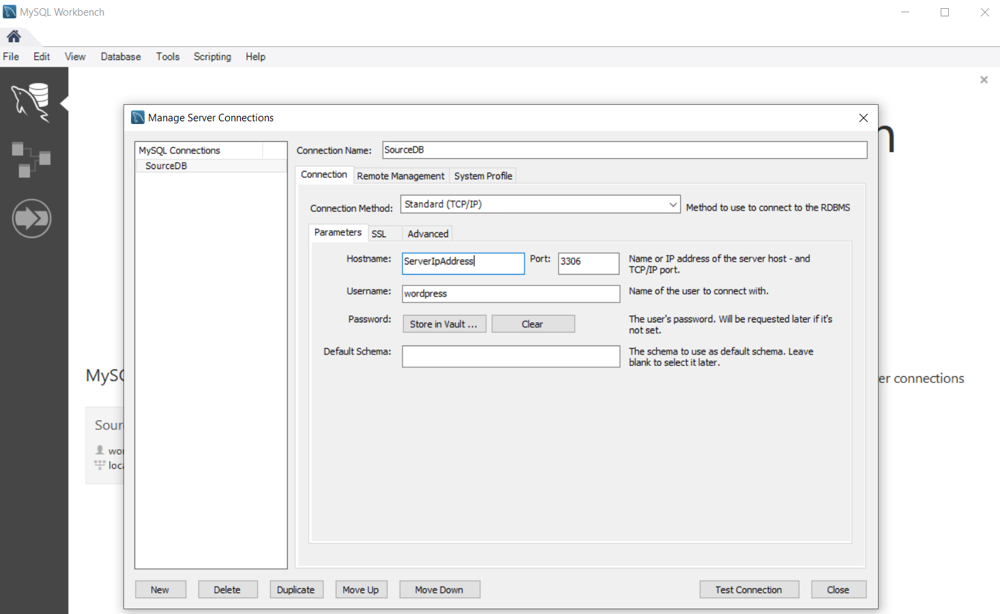

3.  Once you have connected click **Data Export** to start exporting
    your WordPress database. In our case the WordPress Database Name is
    bitnami_wordpress.

    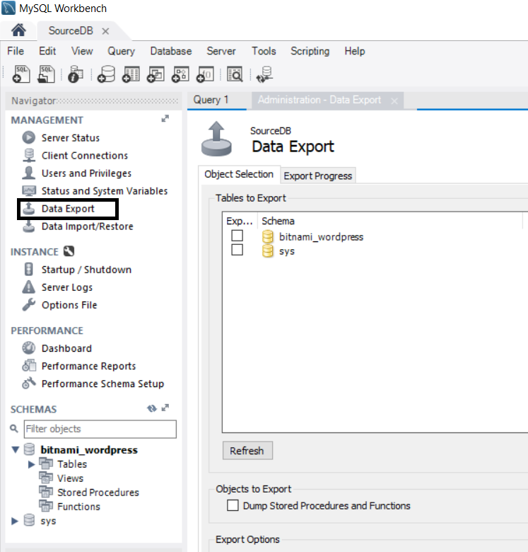

4.  Specify target directory on Export Options. You need to write
    permissions in the directory to which you are writing the backup.
    (All other options can be left at default)

5.  Click Start Export on the lower right of the window.

    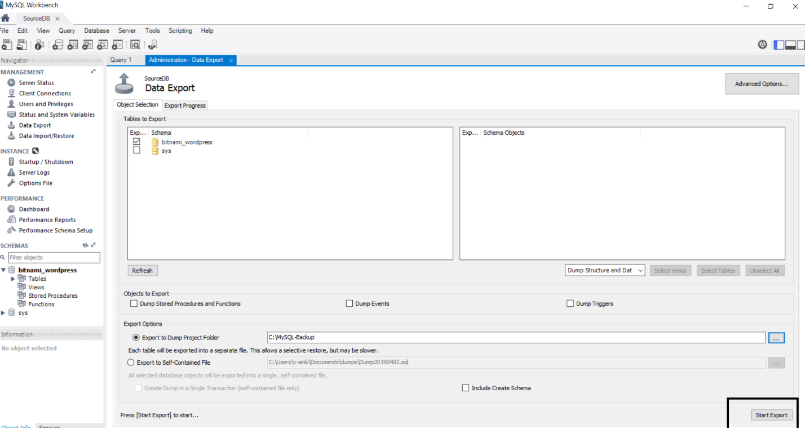

6.  The export process will begin. Once Complete you should see a screen
    like this.

    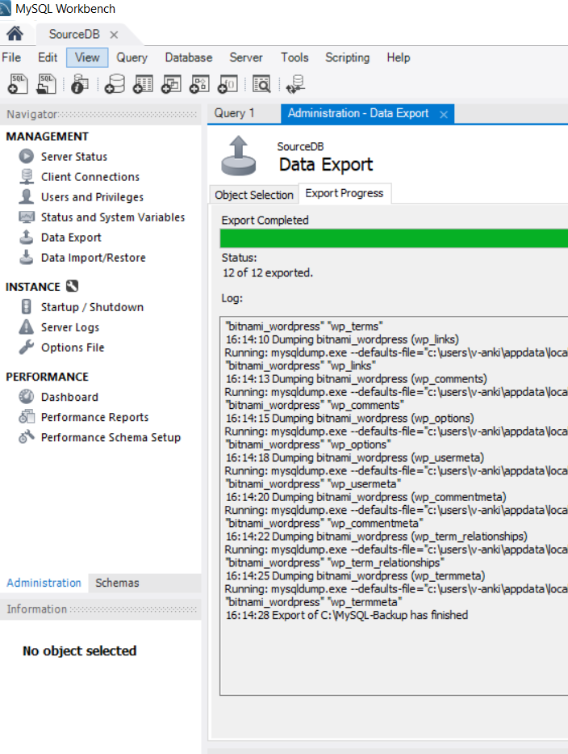

## **Import the database into your Azure WordPress on Linux App Service**

-   In this step we will import the exported data into the Azure MySQL
    instance using MySQL Workbench.

1.  We will first need to gather the connection info for your Azure
    MySQL database. This can be found by navigating to your web app in
    the Azure portal, then navigating to **Configuration** then find
    **Application Settings** tab at the top. Click the **Show Values**
    button to make the values visible. Leave this window open as this
    information will be needed again in a later step.

    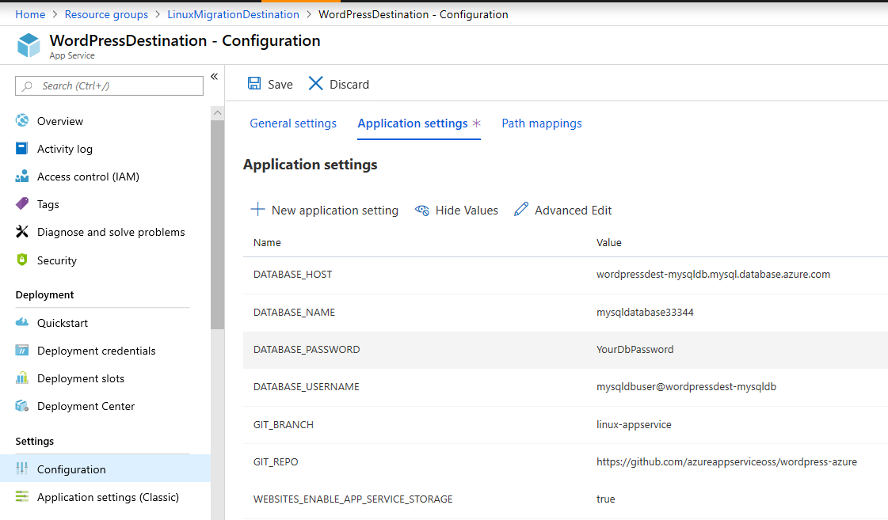

2.  Return to your MySQL Workbench. Click the **+** to open a new
    connection. Then enter the information from the **Application
    Settings** tab. Click **Store in Vault** to enter the password.

    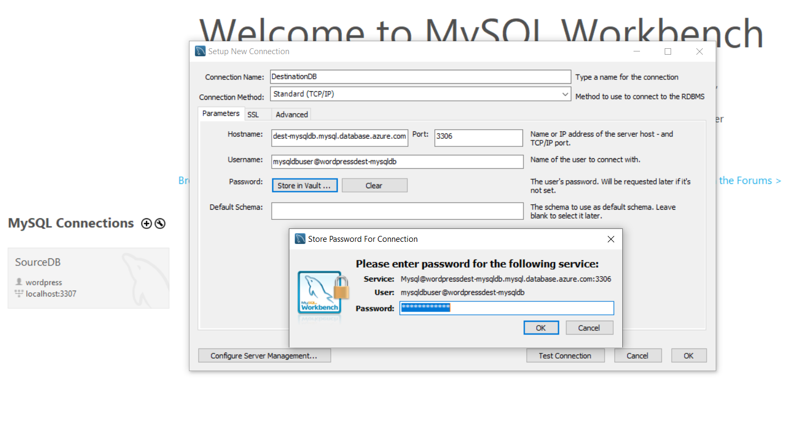

3.  Once the information is entered click **OK**.

4.  The connection will appear under **MySQL Connections**. Click the
    connection to start.

    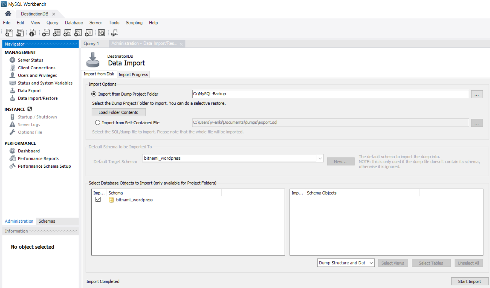

5.  Click **Data Import/Restore** on the left.

6.  Click the **... to** the right of **Import from Dump Project
    Folder**. This will be the folder where we exported the files from
    your source server. Enter the same database name as your source.
    This creates.

7.  To the right of **Default Target Schema** (Note: MySQL Workbench
    refers to Databases as schemas) click **New.** The database name
    should be identical to the database name on your source server.

8.  Click **Start Import** to import the Database.

9.  Once the import completes click **Schemas** from the lower left
    hand. This will display the current Databases.

    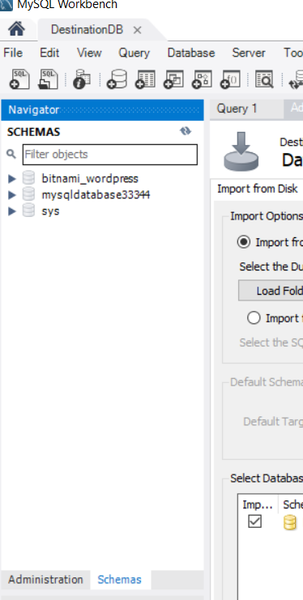

10. You will see the database you imported. You may now delete the
    existing MySQL database by right clicking and selecting **Drop
    Schema**. (Note: Do Not delete the SYS database)

11. In the Azure Portal return to **Application Settings.** Set the
    **DATABASE_NAME** to match the imported database.

    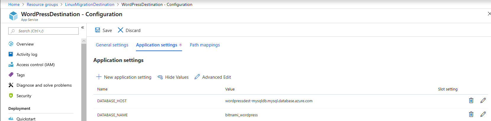

## **Verify Site**

-   You can test the functionality of your new website by clicking the
    **Browse** button**.**

    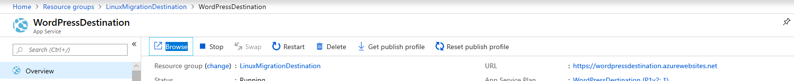

-   Your WordPress site, content, themes and media will now be present
    at the URL.

    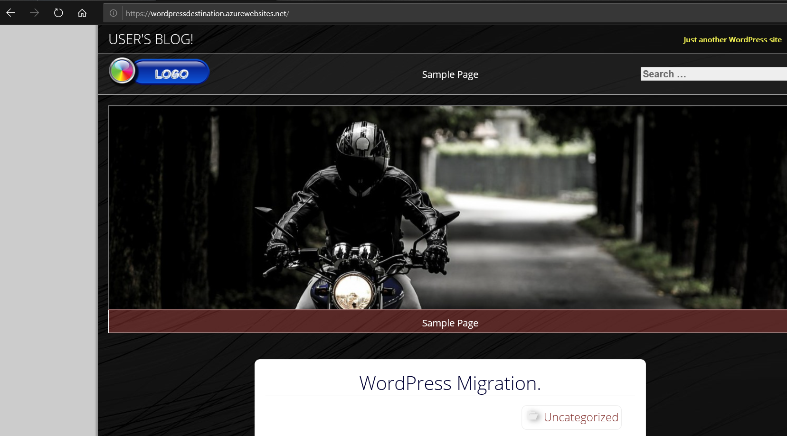

## **Next Steps**

-   [Buy and configure an SSL certificate for Azure App
    Service](https://docs.microsoft.com/en-us/azure/app-service/web-sites-purchase-ssl-web-site)

-   [Buy a custom domain name for Azure App
    Service](https://docs.microsoft.com/en-us/azure/app-service/manage-custom-dns-buy-domain)
